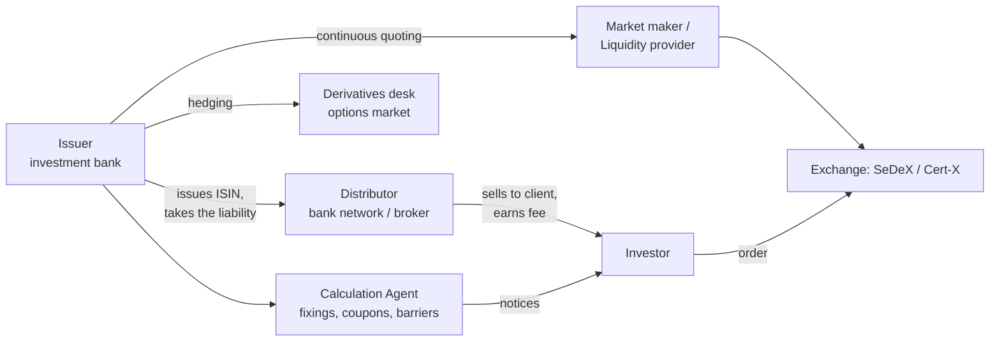
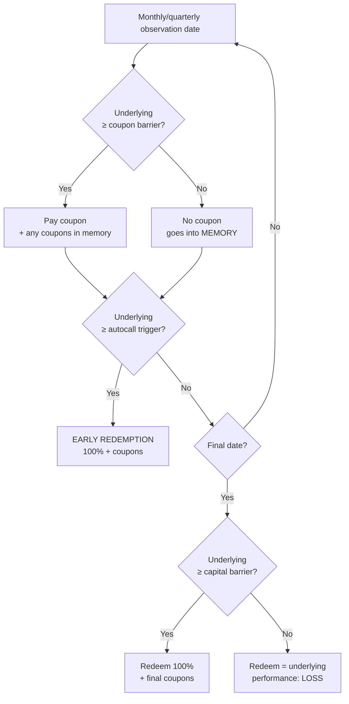
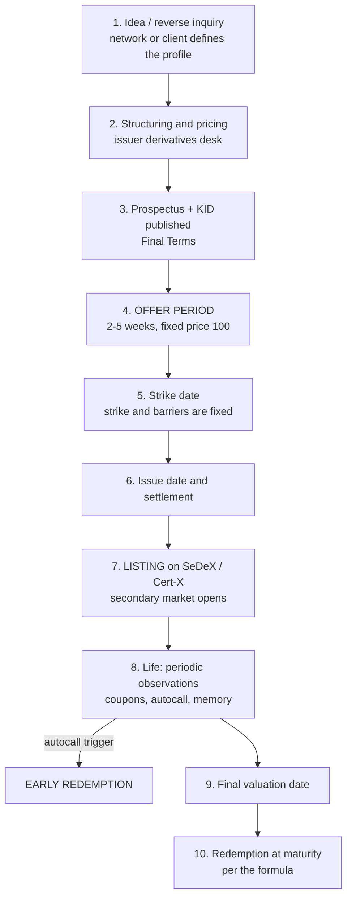
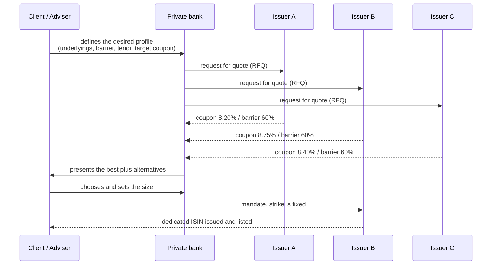

# Investment Certificates — The Complete Guide

> **Educational document, updated September 2026.** This is not investment advice nor a
> solicitation to invest. Certificates are complex instruments: always read the **KID**,
> the **base prospectus** and the **Final Terms** of the specific ISIN before trading.
> All figures in the examples are realistic but **made up for teaching purposes**: real
> terms change daily with interest rates, volatility and dividends.
>
> 🇮🇹 Italian version: [`certificates-guida-completa.md`](./certificates-guida-completa.md)

---

## Table of contents

1. [What a certificate actually is](#1-what-a-certificate-actually-is)
2. [The players in the value chain](#2-the-players-in-the-value-chain)
3. [Anatomy: every variable of a certificate](#3-anatomy-every-variable-of-a-certificate)
4. [The building blocks: calls, puts, in the money, exotics](#4-the-building-blocks-calls-puts-in-the-money-exotics)
5. [Taxonomy: the four families](#5-taxonomy-the-four-families)
6. [Product types, one by one, with payoff diagrams](#6-product-types-one-by-one-with-payoff-diagrams)
7. [Barriers: the variable that decides everything](#7-barriers-the-variable-that-decides-everything)
8. [Add-on mechanisms: memory, autocall, step-down, worst-of, airbag, cap](#8-add-on-mechanisms)
9. [How the price is built: financial decomposition](#9-how-the-price-is-built-financial-decomposition)
10. [The Greeks and the value drivers](#10-the-greeks-and-the-value-drivers)
11. [Life cycle: from primary market to redemption](#11-life-cycle-from-primary-market-to-redemption)
12. [Buying in practice: where, how, at what price](#12-buying-in-practice-where-how-at-what-price)
13. [Negotiation: retail, private, institutional](#13-negotiation-retail-private-institutional)
14. [Listing venues](#14-listing-venues)
15. [Taxation (Italy) and loss offsetting](#15-taxation-italy-and-loss-offsetting)
16. [How you make money — investor side](#16-how-you-make-money--investor-side)
17. [How money is made — issuer, distributor, adviser](#17-how-money-is-made--issuer-distributor-adviser)
18. [Risks, no sugar-coating](#18-risks-no-sugar-coating)
19. [Three full numerical case studies](#19-three-full-numerical-case-studies)
20. [Pre-trade operating checklist](#20-pre-trade-operating-checklist)
21. [Glossary](#21-glossary)

---

## 1. What a certificate actually is

An **investment certificate** is a **securitised derivative**: a debt security issued by a
bank, with its own ISIN, tradable on an exchange like a share, whose redemption is not fixed
but **driven by a formula** linked to the performance of an underlying asset.

Three statements to hold together:

| A certificate **is** | A certificate **is not** |
|---|---|
| A debt claim on the issuing bank | A fund, an ETF, a ring-fenced pool of assets |
| A container of options, packaged for retail | A deposit (no €100k deposit-guarantee protection) |
| A finite-life instrument with a pre-defined formula | Active management: nobody "decides" anything after issuance |

### The fundamental equation

Every certificate, without exception, decomposes as:

```
CERTIFICATE  =  ZERO COUPON BOND issued by the bank
                +  A PORTFOLIO OF OPTIONS (bought and/or sold)
                −  ISSUER AND DISTRIBUTOR MARGIN
```

Everything else in this document follows from that equation: if you know which options are
inside, you already know how the instrument will behave, what drives its price, and where
the revenues (yours and the bank's) come from.

### Why they exist

Because they let you buy a **risk/return profile that does not exist with plain shares and
bonds**. Real-world needs:

- "I want equity exposure but with a **-40% cushion**" → conditionally protected capital.
- "I want a **9% coupon stream** and I accept losses if the stock collapses" → cash collect.
- "I have **€150,000 of realised capital losses expiring** and need offsettable gains" → tax use.
- "I want exposure to a basket of 3 stocks without buying the 3 stocks" → worst-of.
- "I want my nominal protected at 5 years but still participate in the upside" → capital protection.

---

## 2. The players in the value chain



| Player | Role | How they earn |
|---|---|---|
| **Issuer** | Issues the security, owes the redemption, hedges in the options market | Structuring margin + hedging P&L |
| **Distributor** | Sells to clients during the primary offer | Upfront placement fee (1–4%) |
| **Calculation Agent** | Takes fixings, checks barriers, computes coupons and redemption | Usually the issuer itself (conflict of interest) |
| **Market maker** | Posts continuous bid/ask prices | Bid/ask spread |
| **Exchange / MTF** (SeDeX, Cert-X, Vorvel) | Provides the trading venue | Listing and trading fees |
| **Investor** | Buys the payoff profile | Coupons, redemption, capital gains, tax savings |

> ⚠️ **Structural note**: in most cases the issuer, the calculation agent and the market
> maker **belong to the same banking group**. This is the main asymmetry of the market: the
> party selling you the product also values it and makes its secondary-market price.

---

## 3. Anatomy: every variable of a certificate

| Variable | Meaning | Typical example |
|---|---|---|
| **ISIN** | Unique identifier | `XS2XXXXXXXXX`, `DE000XXXXXXX` |
| **Issuer** | Who pays at maturity | BNP Paribas, Société Générale, Vontobel, Leonteq, Marex, UniCredit, Intesa, Mediobanca, Barclays, Citi, Goldman Sachs, J.P. Morgan, Natixis |
| **Underlying** | Share, index, basket, ETF, commodity, rate, FX, crypto | Eni; EURO STOXX 50; {Eni, Intesa, Stellantis} |
| **Denomination (nominal)** | Face value of one certificate | €100 or €1,000 |
| **Issue price** | What you pay in the primary market | 100 (= 100% of nominal) |
| **Strike / Initial level** | Underlying level fixed at the strike date | Eni = €14.00 |
| **Capital barrier** | Level below which protection is lost | 60% of strike = €8.40 |
| **Coupon barrier** | Level required to receive the coupon | 70% of strike = €9.80 |
| **Barrier observation type** | Continuous (American) or final (European) | Final — today's market standard in Italy |
| **Coupon** | Periodic amount, conditional or unconditional | 0.75% monthly = 9% p.a. |
| **Memory effect** | Unpaid coupons accrue and can be recovered later | Yes / No |
| **Autocall** | Trigger above which the note redeems early | 100% from month 12 |
| **Step-down trigger** | The autocall level decreases over time | −2.5% per quarter |
| **Bonus / Cap** | Conditional minimum redemption / maximum redemption | Bonus 118%, Cap 118% |
| **Participation** | % participation in the underlying move | 70%, 100%, 150% |
| **Maturity** | Final redemption date | 3 years |
| **Final valuation date** | When the level that drives redemption is observed | 5 business days before maturity |
| **Multiplier / Parity** | How many underlying units one certificate represents | Nominal / Strike |
| **Currency and Quanto** | Denomination currency and FX hedge | EUR; *quanto* = FX risk neutralised |
| **Minimum lot** | Minimum tradable size | 1 certificate |
| **Listing venue** | Where it trades | SeDeX, Cert-X (EuroTLX), Vorvel |

---

## 4. The building blocks: calls, puts, in the money, exotics

### 4.1 Calls and puts in 30 seconds

| | **CALL** | **PUT** |
|---|---|---|
| Gives the right to | **buy** at strike K | **sell** at strike K |
| The **buyer** profits if | the underlying **rises** | the underlying **falls** |
| The **seller** receives | a premium now, risk if it rises | a premium now, **risk if it falls** |

```
          LONG CALL PAYOFF                       SHORT PUT PAYOFF
  profit |            /                   profit |________
         |           /                           |        \
       0 |__________/______  underlying        0 |________ \______  underlying
         |         K                             |        K \
    loss |                                  loss |           \
   (max loss = premium)                    (loss potentially huge)
```

> 🔑 **The single most important idea in this market**: when you buy a high-coupon
> certificate (cash collect, phoenix, reverse convertible, bonus) **you are selling a put**
> to the issuer. The fat coupon is not a gift — it is **the premium of the put you sold**.
> High coupon = expensive put sold = high risk. Always.

### 4.2 In the money, at the money, out of the money

| State | Call | Put | Certificate jargon |
|---|---|---|---|
| **ITM** | Underlying **> strike** | Underlying **< strike** | "the certificate is in the money" = underlying **above** strike/barrier → favourable |
| **ATM** | Underlying ≈ strike | Underlying ≈ strike | maximum uncertainty, maximum gamma, very jumpy price |
| **OTM** | Underlying **< strike** | Underlying **> strike** | underlying below barrier → unfavourable |

An option's **value** = *intrinsic value* (how far ITM it is now) + *time value* (the chance
it improves). Time value decays (**theta**) and hits zero at maturity — which is why a
certificate close to expiry behaves almost like a binary bet.

### 4.3 The exotic options you will find inside

| Option | What it does | Where you find it |
|---|---|---|
| **Down-and-in put** | Comes alive only if the underlying breaches the barrier | Capital barrier of cash collect, phoenix, bonus |
| **Down-and-out put** | Dies if the barrier is touched | Bonus, twin win |
| **Digital (binary)** | Pays a fixed amount if a condition holds, zero otherwise | Every conditional coupon |
| **Zero-strike call** | Replicates the underlying **without dividends** | The base of nearly every equity certificate |
| **Call spread** | Long call K1 + short call K2 | Any structure with a **cap** |
| **Worst-of option** | Looks only at the worst of N underlyings | Multi-underlying notes |
| **Knock-out / Turbo** | Expires worthless if a level is touched | Leverage certificates |
| **Lookback / Asian** | Uses an average or the max/min of the period | "Average" structures, timing protection |

---

## 5. Taxonomy: the four families

```
                        CERTIFICATES
                              │
   ┌──────────────┬───────────┴───────────┬────────────────┐
   │              │                       │                │
 CAPITAL      CONDITIONALLY            CAPITAL          LEVERAGE
 PROTECTED    PROTECTED             NOT PROTECTED
   │              │                       │                │
Equity Prot.   Cash Collect          Benchmark        Turbo / Mini future
Digital        Phoenix               Tracker          Constant Leverage
Butterfly      Express               Outperformance   Covered Warrants
Prot. + coupon Bonus / Bonus Cap     (no barrier)
               Reverse Convertible
               Twin Win / Airbag
   │              │                       │                │
 risk ↑        risk ↑↑                risk ↑↑↑         risk ↑↑↑↑↑
 horizon       horizon 2-5y           variable         intraday/weeks
 3-7 years
```

| Family | Protection | Who uses it | Typical expected return |
|---|---|---|---|
| **Capital protected** | 100% (or 90/95%) of nominal **at maturity**, subject to issuer solvency | Bond substitute | 2–5% p.a. |
| **Conditionally protected** | Only if the barrier is not breached | 70–80% of the Italian retail market | 5–12% p.a. |
| **Not protected** | None | Replication or participation plays | = underlying ± participation |
| **Leverage** | None, with knock-out | Very short-term traders | ±100% in days |

---

## 6. Product types, one by one, with payoff diagrams

In the diagrams: horizontal axis = **underlying at maturity** as % of strike; vertical axis
= **redemption** as % of nominal.

---

### 6.1 Capital Protection / Equity Protection

**Purpose**: protect the nominal while participating in the upside.
**Build**: `ZC bond (100 at maturity) + ATM call × participation [− call at the cap]`

```
redemption %
  160 |                          _________________  ← CAP 160%
      |                        /
  130 |                      /   ← slope = participation (e.g. 70%)
      |                    /
  100 |________________ /        ← PROTECTION: below 100 you still get 100
      |
      +----|---------|---------|---------|-------→ underlying at maturity
          50        100       150       200
```

- **Pros**: you sleep at night; nominal protected subject to issuer solvency.
- **Cons**: you give up dividends (that is how protection is funded), participation < 100%,
  protection applies **only at maturity** (it can trade at 85 in the meantime), long tenors (5–7y).
- **Digital variant**: instead of participation, a fixed coupon if the index is above a level.

---

### 6.2 Bonus and Bonus Cap

**Purpose**: earn a fixed return even if the underlying falls, as long as the barrier holds.
**Build**: `zero-strike call + down-and-out put (strike = bonus level) [− call at the cap]`

```
redemption %
  118 |_________________________          ← BONUS = CAP 118%
      |                         |
  100 |                         |
      |         (if barrier     |
   70 |  ....... NOT breached)  |
      |      /                  |
   50 |    /   ← if breached you track the underlying 1:1
      +--|-----|--------|-------|-----→ underlying at maturity
        50    70(BAR)  100     118
```

**How to read it**: you make **+18% even if the stock is down 29%**. You only lose if it
falls more than 30% (the barrier). In exchange you give up everything above 118 (the cap).

---

### 6.3 Cash Collect (the Italian best-seller)

**Purpose**: turn a volatile stock into a **periodic income stream**.
**Build**: `ZC bond + a strip of digital options (coupons) − down-and-in put (barrier) [+ autocall]`



- **Coupons**: 0.5–1.5% monthly, or 2–4% quarterly. Worst-of baskets on volatile names reach
  10–15% p.a.
- **Real average life**: far shorter than stated maturity because of the autocall — many cash
  collects redeem within 12–18 months.
- **The real risk**: the *down-and-in put* you sold. If the worst-of collapses, you redeem in
  proportion to its loss.

---

### 6.4 Phoenix

A cash collect variant where the **coupon barrier sits below the capital barrier** (or, more
generally, the structure is designed to "rise from the ashes": after months with no coupon,
if the underlying climbs back above the barrier you start collecting again, and with
**memory** you recover the whole backlog). In Italian retail marketing, *Phoenix* and *Cash
Collect with memory* are now near-synonyms.

---

### 6.5 Express

Built **around early redemption**: few or no periodic coupons, but a **growing premium** paid
in one shot when the autocall triggers.

```
Year 1: underlying ≥ 100% → redeem 100 + 8  = 108
Year 2: underlying ≥  95% → redeem 100 + 16 = 116   (cumulated premium)
Year 3: underlying ≥  90% → redeem 100 + 24 = 124
Maturity: if ≥ 60% barrier → 100 + 32 = 132; otherwise track the underlying
```

---

### 6.6 Reverse Convertible

The ancestor, and the most honest in its brutality: a **high unconditional fixed coupon**,
redemption at 100 only if the underlying is above strike, otherwise **physical delivery of
the shares** (or cash equivalent).
**Build**: `bond + short ATM put`. Literally a sold put with the coupon as its premium.

---

### 6.7 Twin Win

You win **both if it rises and if it falls**, as long as the barrier holds: negative
performance is converted into positive in absolute value.
**Build**: `zero-strike call + 2 × down-and-out ATM put`

```
redemption %
  140 |          \           /
      |           \        /
  120 |            \     /
  100 |             \  /
      |   (below the barrier you fall with the underlying)
      +----|--------|--------|--------|---→
          60(BAR)  80       100      140
           ↑ performance −20% → redemption 120
```

---

### 6.8 Outperformance

**Above-100% participation** in the upside (e.g. 150%), paid for by giving up dividends, with
1:1 participation on the downside.
**Build**: `zero-strike call + 0.5 × ATM call` (for 150% participation).

---

### 6.9 Benchmark / Tracker

Plain linear replication of the underlying, useful to access markets that are otherwise hard
to reach (exotic indices, thematic baskets, commodities). No barrier, no protection.
**Watch out**: issuer risk on an instrument that looks like an ETF but is not one.

---

### 6.10 Leverage certificates: Turbo, Mini Future, Constant Leverage

| Type | Mechanics | Specific risk |
|---|---|---|
| **Turbo / Mini Future** | Variable leverage from implicit financing; **knock-out** if the barrier is touched → the note dies (often at zero or a small residual) | Instant knock-out, overnight gaps |
| **Constant Leverage** (×3, ×5, ×7) | Constant **daily** leverage | **Compounding decay**: in choppy sideways markets you lose even if the underlying returns to its starting point |

> Decay example, ×5 constant leverage: day 1 the underlying is +10% → certificate +50%
> (100 → 150). Day 2 the underlying is −9.09% (back to its start) → certificate −45.45% →
> **81.8**, not 100. The underlying is flat; you are down 18%.

---

## 7. Barriers: the variable that decides everything

### 7.1 Observation types

| Type | How it works | Risk | Effect on terms |
|---|---|---|---|
| **European / final** (*at maturity*) | Observed **only on the final valuation date** | 🟢 Much safer: a temporary crash does not count | Lower coupons |
| **American / continuous** | **One single instant** below the barrier, any time, is enough | 🔴 Very dangerous: a flash crash burns the protection | Higher coupons |
| **Discrete** | Observed on set dates only (e.g. month-end) | 🟡 In between | In between |

> ✅ **Rule of thumb**: European/final barriers dominate today's Italian retail market. If
> someone offers you a **continuous** barrier, the coupon must be materially higher to justify
> it. Always check this field in the KID: it is the difference between sleeping and not sleeping.

### 7.2 Capital barrier vs coupon barrier

```
 100% ─────────────── STRIKE (initial level) ── the reference for everything
  95% ─ ─ ─ ─ ─ ─ ─ ─ AUTOCALL trigger (often with step-down)
  70% ─ ─ ─ ─ ─ ─ ─ ─ COUPON BARRIER  → above: you collect. below: memory
  60% ═══════════════ CAPITAL BARRIER → below at maturity: PROPORTIONAL LOSS
```

### 7.3 The cliff effect (digital risk)

A barrier creates a **discontinuity**: at maturity, 59.9% and 60.1% of the strike produce
redemptions of 59.9 and 100. That is why:

- Near the barrier and near maturity the price becomes **hyper-sensitive**;
- The market maker widens the spread exactly when you want out;
- Buying a certificate "just above the barrier" because it looks cheap is buying a coin toss.

### 7.4 Distance from the barrier = the real risk metric

| Distance from barrier | Reading |
|---|---|
| > 45% | Very conservative — low coupon |
| 30–45% | Balanced (the most common zone) |
| 15–30% | Aggressive |
| < 15% | You are essentially long the stock, with your upside capped |

---

## 8. Add-on mechanisms

| Mechanism | What it does | Effect for you |
|---|---|---|
| **Memory** | Unpaid coupons accrue and are paid at the first favourable observation | 🟢 Very favourable: turns "not paid" into "paid later" |
| **Autocall** | Early redemption at 100% if above the trigger | 🟡 Closes your trade when it is going well (reinvestment risk) |
| **Step-down / Step-up** | The autocall trigger falls (or rises) over time | 🟢 Step-down raises the odds of a call |
| **Worst-of** | The formula looks only at the **worst** of N underlyings | 🔴 Big risk increase: one collapse is enough |
| **Best-of / Rainbow** | Looks at the best | 🟢 Rare and expensive |
| **Airbag** | Below the barrier, losses are softened by re-basing on the barrier level instead of the strike | 🟢 Cushions the cliff |
| **Cap** | Maximum redemption | 🔴 You give up the upside — but it is what funds the rest |
| **Low Strike** | Strike set below the current price (e.g. 50%) | 🟢 Ultra-defensive, low coupons |
| **Quanto** | Neutralises FX risk | 🟡 Costs you in terms |

### 8.1 Why worst-of pays so much (and why it is treacherous)

With 3 underlyings, the probability that **at least one** breaches the barrier is much higher
than for any single pre-chosen name.

```
P(barrier breach), 60% barrier, 3 years, 30% volatility:
  1 underlying             →  ~18%
  3 independent underlyings →  ~1 − (0.82)³  ≈  45%
```

That is why the coupon goes from ~5% to ~10%: **you are being paid for materially more risk**.
And there is a second variable:

| Correlation between underlyings | Worst-of put price | Coupon offered | Real risk |
|---|---|---|---|
| High (same sector) | Lower | Lower | Lower (they move together) |
| **Low** (different sectors/countries) | **Higher** | **Higher** | **Higher** (one weak link is enough) |

> 🔑 If you see a worst-of with an off-market coupon, look at the basket: there is almost
> always **one weak or very volatile name** paying everybody's coupon.

---

## 9. How the price is built: financial decomposition

This is the chapter that separates people who buy certificates from people who understand them.

### 9.1 Decomposition example (3-year Cash Collect, nominal 100)

| Component | Who buys/sells | Value |
|---|---|---|
| **Zero coupon bond** (100 at 3 years, risk-free 3% + 0.8% issuer credit spread) | Investor buys | **+89.4** |
| **Digital options** (36 conditional monthly coupons of 0.75%) | Investor buys | **+14.0** |
| **Down-and-in put** (strike 100, 60% barrier, worst-of) | Investor **sells** → receives premium | **−9.0** |
| **= Theoretical fair value at issue** | | **= 94.4** |
| **Price paid by the investor in the primary market** | | **100.0** |
| **Difference = issuer margin + placement fee** | | **5.6 (5.6%)** |

### 9.2 Three practical consequences

1. **The "day-2 drop"**: the day after issuance the market maker quotes near fair value.
   Seeing 96–98 is normal. **It is not an error: it is the distribution cost surfacing.**
2. **Buying in the secondary market is almost always cheaper**: no placement fee, only the
   bid/ask spread (typically 0.3–1%).
3. **Always compare the promised return with the risk you sold**: if the put you sold is worth
   9 and the coupons are worth 14, your genuine excess return over the risk-free rate is far
   smaller than the "9% p.a." on the cover page.

### 9.3 What drives the terms you are offered

| Market variable | If it rises... | Effect on your terms |
|---|---|---|
| **Interest rates** | ↑ | 🟢 Better (the ZC bond costs less, more budget for options) |
| **Implied volatility** | ↑ | 🟢 Better (the put you sell is worth more) |
| **Dividend yield of the underlying** | ↑ | 🟢 Better (forgone dividends fund the structure) |
| **Issuer credit spread** | ↑ | 🟢 Better terms... but 🔴 more counterparty risk |
| **Correlation (worst-of)** | ↓ | 🟢 Higher coupons, 🔴 higher risk |
| **Tenor** | ↑ | 🟢 More budget, 🔴 more risk and less liquidity |

> 📌 **Timing**: the best moments to **buy** yield-enhancement certificates are periods of
> **high volatility and high rates** (crises, panic, elevated VIX) — precisely when instinct
> says to stay out.

---

## 10. The Greeks and the value drivers

| Greek | Measures | Inside a certificate |
|---|---|---|
| **Delta** | Sensitivity to the underlying | Low (0.1–0.3) when far above the barrier; rises towards 1 as the barrier approaches |
| **Gamma** | Speed of delta change | **Explodes near the barrier and near maturity** → unstable price |
| **Vega** | Sensitivity to volatility | **Negative** in most coupon certificates (you sold options): rising volatility hurts you |
| **Theta** | Time decay | **Positive** for an option seller: the passing of time works for you |
| **Rho** | Sensitivity to rates | Material on long capital-protected structures |
| **Credit-spread sensitivity** | Issuer risk | If the market fears the issuer, your certificate falls **even with a flat underlying** |
| **Correlation sensitivity** | Worst-of only | Falling correlation destroys value for you |

**Operational translation**: a cash collect is, in risk terms, **a short-volatility,
long-time position**. You earn when nothing happens. You lose when markets move violently down.

---

## 11. Life cycle: from primary market to redemption



### Dates to put in your calendar

| Date | Why it matters |
|---|---|
| **End of offer period** | Last day to subscribe in the primary market |
| **Strike date** | Fixes strike and barriers: from here everything is determined |
| **Observation dates** | Coupons and autocalls: the price jumps around these dates |
| **Coupon ex-date** | Certificates trade **dirty**: on the ex-date the price drops by the coupon. That is not a loss. |
| **Final valuation date** | This is where redemption is decided — **not** the maturity date |
| **Maturity / payment date** | Cash credited, usually 3–5 business days after valuation |

---

## 12. Buying in practice: where, how, at what price

### 12.1 The two routes

```
              ┌─────────────────────────────┐        ┌────────────────────────────┐
              │   PRIMARY MARKET             │        │   SECONDARY MARKET         │
              │   (placement)                │        │   (exchange)               │
              ├─────────────────────────────┤        ├────────────────────────────┤
 Price        │ fixed at 100 (nominal)       │        │ live bid/ask quote         │
 Costs        │ 1-4% placement fee           │        │ bid/ask spread + broker    │
              │ EMBEDDED in the price        │        │ commission                 │
 Window       │ 2-5 weeks                    │        │ every day, 9:00-17:30      │
 Terms        │ indicative until strike date │        │ fully known and verifiable │
 Advantage    │ brand-new terms at today's   │        │ 🟢 you pay less            │
              │ market levels                │        │ 🟢 you see the real        │
              │                              │        │    distance to barrier     │
              └─────────────────────────────┘        └────────────────────────────┘
```

### 12.2 Concrete steps to buy in the secondary market

1. **Find the ISIN** (issuer website, exchange certificate section, comparison tools).
2. **Download and read the KID** (3 pages): SRI risk indicator 1–7, performance scenarios,
   costs, recommended holding period.
3. **Read the Final Terms** for exact strikes, barriers, observation type and dates.
4. **Check the current state**: where the underlying sits versus strike and barrier *today*.
5. **Look at the order book**: bid/ask spread, quoted size, market maker presence.
6. **Use a LIMIT order** (never "at market" on certificates: liquidity is essentially the
   market maker, and a wide spread eats your return).
7. **Try to step inside the spread**: if the book is 98.50 / 99.00, bid 98.75. It often fills —
   this is the retail investor's form of negotiation.
8. **T+2 settlement** (current European standard; the EU is expected to move to T+1 in 2027).
9. **Monitor** the observation dates and the distance to the barrier — not your entry price.

### 12.3 Total cost budget

| Item | Order of magnitude |
|---|---|
| Placement fee (primary only) | 1–4% one-off, embedded in the price |
| Issuer structuring margin | 1–3% embedded |
| Secondary bid/ask spread | 0.2–1.5% (wider on illiquid names or near the barrier) |
| Broker trading commission | 0.1–0.5%, often with a min/max |
| Securities stamp duty (Italy) | 0.20% p.a. on market value |
| Taxation (Italy) | 26% on income |

---

## 13. Negotiation: retail, private, institutional

### 13.1 Retail — you negotiate the price, not the terms

In the primary market **nothing is negotiable**: the product is packaged, take it or leave it.
Your only lever is **choosing a different product**. In the secondary market:

- **Limit orders inside the spread** → you are negotiating with the market maker;
- **Split the order** across days so the spread does not hit the full size;
- **Avoid the open and the close**, when spreads are widest;
- **Ask your broker** about volume discounts and multi-venue access.

### 13.2 Private banking / family office — the tailor-made certificate

Above a certain size (indicatively **€500,000 – €1,000,000**, lower when aggregated in a
*club deal*), you move to **tailor-made**:



**What is actually negotiable here — this is the heart of "the negotiation"**:

| Lever | How it is negotiated |
|---|---|
| **Coupon level** | Lower the barrier or extend the tenor to lift it |
| **Barrier level** | Accept a smaller coupon for a deeper barrier |
| **Basket composition** | Removing the most volatile name cuts the coupon but cuts risk far more |
| **Barrier observation type** | Always ask for **European/final** |
| **Memory and airbag** | Ask explicitly: they cost little and are worth a lot |
| **Autocall trigger and step-down** | Determines the expected life of the investment |
| **Placement fee** | 🔑 **The most negotiable item of all**: cutting it from 3% to 1% directly improves your terms |
| **Multi-issuer competition** | Putting 3 issuers in competition is typically worth 30–80 bps of coupon |

### 13.3 Institutional — reverse inquiry and private placement

Funds, insurers and pension schemes buy via **reverse inquiry**: they specify the payoff, take
OTC quotes, and trade under an ISDA or as a structured note off an EMTN programme. Here the
negotiation is pure: price, size, collateral, unwind rights, documented mid-market levels.
Typical minimum ticket: €1–5m.

---

## 14. Listing venues

### 14.1 Italy

| Venue | Operator | Notes |
|---|---|---|
| **SeDeX** | Borsa Italiana (Euronext group) — MTF | The historic market for certificates and covered warrants. Market makers have continuous quoting obligations (max spread, min size). Indicative hours **09:00–17:30 CET**. |
| **Cert-X** (segment of **EuroTLX**) | Borsa Italiana / Euronext — MTF | Widely used for certificates placed through bank networks. |
| **Vorvel** (formerly Hi-MTF) | Vorvel SIM | Dedicated segment used by some issuers and networks. |
| **OTC / systematic internalisers** | Individual banks | Some networks trade their own certificates off-exchange. |

> By number of listed instruments and retail participation, Italy is **one of the most
> developed certificate markets in Europe**. Reference sources for data: periodic **ACEPI**
> reports and **Borsa Italiana** statistics.

### 14.2 Europe

| Venue | Country | Notes |
|---|---|---|
| **EUWAX (Börse Stuttgart)** | Germany | Europe's largest retail structured-products market |
| **Börse Frankfurt Zertifikate** | Germany | Huge turbo and leverage offering |
| **SIX Structured Products** | Switzerland | SSPA standard, strong in barrier reverse convertibles |
| **Euronext (Paris, Amsterdam, Brussels)** | France/Benelux | Broad warrant and certificate offering |
| **SpectrumMarkets** | Pan-European | 24/5 trading on turbos |

### 14.3 Market maker obligations (why they matter to you)

Under exchange rules the liquidity provider undertakes to:
- post **simultaneous** bid and ask prices;
- respect a **maximum spread** and a **minimum size**;
- quote for a **minimum percentage of the session**.

They may **suspend quotes** in exceptional cases (underlying suspended, extreme market events,
issue fully sold). That is exactly when you want to exit: price it into your liquidity risk.

---

## 15. Taxation (Italy) and loss offsetting

> ⚠️ Tax rules change: what follows is the general Italian framework and **must be verified**
> with your intermediary and against current law. Non-Italian investors: your own regime applies.

### 15.1 The framework

| Aspect | Treatment |
|---|---|
| **Nature of the income** | Certificates are **securitised derivatives**: proceeds (coupons, premiums, differentials, gains) are generally **"redditi diversi"** (miscellaneous income, art. 67 TUIR) |
| **Rate** | **26%** (12.5% on the portion attributable to government/white-list bonds, where applicable) |
| **Offsetting** | 🔑 **Miscellaneous income can be offset against previously realised capital losses** |
| **Carry-forward** | Losses usable in the year realised **and the following 4** |
| **Regimes** | Administered (bank acts as withholding agent) or declarative |
| **Stamp duty** | **0.20% p.a.** on the market value held in custody |
| **To verify** | On **fully and unconditionally capital-protected** certificates, some components may be treated differently: read the prospectus and ask your intermediary |

### 15.2 Why this is the real ace of certificates in Italy

```
        INSTRUMENT                   INCOME NATURE            OFFSETS CAPITAL LOSSES?
  ───────────────────────────────────────────────────────────────────────────────────────
  Bond coupon                   →  capital income        →   ❌ NO
  Share dividend                →  capital income        →   ❌ NO
  ETF/fund distribution         →  capital income        →   ❌ NO
  ETF/fund capital gain         →  capital income        →   ❌ NO (in Italy!)
  Share capital gain            →  MISCELLANEOUS income  →   ✅ YES
  CERTIFICATE COUPONS & GAINS   →  MISCELLANEOUS income  →   ✅ YES
```

**Economic consequence**: for an investor with **€100,000 of expiring capital losses**, a
certificate generating €100,000 of proceeds produces a **€26,000 tax saving** that a bond or
an ETF could never unlock. On €500,000 of capital, that is 5.2% of extra return created purely
by instrument selection.

There are certificates **built specifically for loss recovery**: a very large upfront coupon
(e.g. 20–30% paid immediately) followed by a defensive profile. Careful: the maxi-coupon is
**not return**, it is an advance of capital, and the certificate price drops by the same amount
on the ex-date.

---

## 16. How you make money — investor side

### 16.1 The six revenue sources

| # | Source | How it works | Attached risk |
|---|---|---|---|
| 1 | **Periodic coupons** | Monthly/quarterly stream conditional on a barrier | Sold put: you lose if the underlying collapses |
| 2 | **Early redemption (autocall)** | 100% + premium, often within 12–24 months → **high IRR over a short horizon** | Reinvestment risk at worse terms |
| 3 | **Secondary-market capital gain** | Buy at 92, the underlying rallies, sell at 99 without waiting for maturity | Timing, spread, issuer risk |
| 4 | **Bonus / participation at maturity** | Fixed return even with the underlying down | Barrier |
| 5 | **Tax saving** (see §15) | Offsetting losses that would otherwise expire: **26% of real value** | No market risk — pure efficiency |
| 6 | **Defensive return** | You earn in flat or moderately falling markets, where shares and ETFs pay nothing | Capped upside |

### 16.2 Strategies used by professionals

| Strategy | Mechanics | Indicative return | Profile |
|---|---|---|---|
| **Coupon & carry** | 10–20 cash collects diversified by underlying, sector, maturity and issuer | 6–10% gross p.a. | Core income |
| **Maturity laddering** | Staggered maturities every 3–6 months for steady flows and repricing | 6–9% | Treasury management |
| **Rolling autocall** | Systematically reinvest every called capital into new issues | 7–11% | Needs operational discipline |
| **Deep value / distressed** | Buy sub-barrier certificates quoted 45–65 betting on recovery | Very high, very risky | Speculative |
| **Secondary discount** | Buy illiquid certificates below fair value and hold to maturity | +1–3% extra | Patient |
| **Loss recovery** | Pick maxi-coupon certificates before losses expire | 26% of the amount recovered | Tax-driven |
| **Bond substitution** | Capital protection instead of a bond, adding equity participation | 3–6% | Conservative |
| **Portfolio hedging** | Short certificates or put turbos to hedge an equity book | — | Tactical |

### 16.3 How to actually compute the return

Never look at the headline "annual coupon". Compute the **scenario-conditional yield to maturity**:

```
Example: cash collect bought at 96.50 in the secondary market, nominal 100,
0.70% monthly coupon, 20 months to maturity, 60% barrier.

SCENARIO A — Autocall at month 6 (underlying above trigger):
   proceeds = 6 × 0.70 + 100 = 104.20   on 96.50 invested
   return = +7.98% over 6 months  →  annualised IRR ≈ 16.6%

SCENARIO B — No autocall, above barrier at maturity:
   proceeds = 20 × 0.70 + 100 = 114.00
   return = +18.13% over 20 months  →  annualised IRR ≈ 10.5%

SCENARIO C — Worst-of at 45% at maturity (barrier breached), 10 of 20 coupons paid:
   proceeds = 10 × 0.70 + 45 = 52.00
   return = −46.1%

RULE: the true expected return is the PROBABILITY-WEIGHTED AVERAGE of the
scenarios, not the best one.
```

### 16.4 The three rules that separate winners from losers

1. **Diversify by issuer**, not just by underlying. Credit risk is the risk nobody watches
   until it happens (see: Lehman Brothers, 2008).
2. **Never chase the highest coupon**: the coupon is the price of risk. A 15% p.a. coupon is
   the market telling you the barrier has a high probability of breaking.
3. **Buy high volatility, not euphoria**: the best terms come when fear is high, because the
   options you sell are worth more.

---

## 17. How money is made — issuer, distributor, adviser

Understanding where everyone else earns tells you where you are paying.

| Player | Revenue source | Order of magnitude |
|---|---|---|
| **Issuer** | **Structuring margin**: issue price (100) minus theoretical fair value (94–98) | 1–3% of nominal |
| **Issuer** | **Hedging P&L**: the desk dynamically replicates the options and captures the gap between implied volatility sold and realised volatility | Variable — this is the actual business |
| **Issuer** | **Cheap funding**: issuing certificates is a form of bank funding, often cheaper than senior debt | 20–80 bps of funding saving |
| **Issuer** | **Bid/ask spread** from market making | 0.2–1.5% per round trip |
| **Issuer** | **Re-issuance**: every autocall generates a new placement (new margin) | Recurring |
| **Distributor** | **Upfront placement fee**, embedded in the price | 1–4% one-off |
| **Financial adviser / agent** | Retrocession of part of the placement fee | 0.5–2.5% |
| **Fee-only adviser** | Percentage of assets or hourly fee; **cannot** receive retrocessions | 0.3–1% p.a. |

### The business model, in one sentence

> The issuer **sells a package of options above its theoretical value**, banks the difference,
> hedges the risk in the market, and monetises the continuous re-issuance driven by autocalls.
> The distributor monetises its client network.

### If you want to build a business around this

Three economically sustainable and compliant models:

1. **Fee-only advice**: revenue = client fee, no conflict, ISIN selection in the secondary
   market to minimise embedded costs. Requires authorisation (in Italy, OCF registration for
   independent financial advisers).
2. **Authorised distribution** (bank, investment firm, tied agent): revenue = placement fees
   and retrocessions, with MiFID II suitability, product governance and cost-transparency duties.
3. **Education, research and analytics**: revenue = subscriptions, content, screening tools.
   No licence needed as long as you do **not** give personalised recommendations (which is
   regulated investment advice).

> ⚖️ In Italy, investment advice and placement are **reserved, supervised activities**
> (Consob, Bank of Italy, OCF). Any business project in this space should be set up with a
> specialised lawyer before launch. Other jurisdictions have equivalent regimes.

---

## 18. Risks, no sugar-coating

| Risk | Description | Mitigation |
|---|---|---|
| **Issuer (credit) risk** | If the bank fails or is resolved (**bail-in**), the certificate can go to zero. No deposit guarantee, no ring-fenced assets. | Diversify issuers; watch ratings and CDS; prefer systemic issuers |
| **Market risk** | The underlying breaks the barrier | Deep barriers, solid underlyings, adequate horizon |
| **Liquidity risk** | The market maker widens spreads or suspends quotes | Prefer traded ISINs; limit orders; size positions properly |
| **Gap risk** | On continuous barriers or turbos, an overnight jump breaches the level with no chance to react | Avoid continuous barriers; avoid tight knock-outs |
| **Reinvestment risk** | The autocall returns your capital when rates have fallen | Maturity laddering |
| **Cap risk** | The underlying doubles and you take home +18% | Accept it consciously: it is the price of the cushion |
| **Complexity risk** | Multi-condition formulas almost nobody reads in full | Rule: **if you cannot draw the payoff, do not buy it** |
| **FX risk** | Foreign-currency underlying without a *quanto* feature | Look for *quanto* versions or hedge |
| **Tax/regulatory risk** | Changes to loss-offsetting rules | Never build a strategy on the tax edge alone |
| **Conflict of interest** | Issuer = market maker = calculation agent | Benchmark prices against theoretical fair value and similar products from other issuers |

---

## 19. Three full numerical case studies

### CASE A — Worst-of Cash Collect with memory and autocall

| Parameter | Value |
|---|---|
| Nominal | €1,000 |
| Tenor | 3 years (36 monthly observations) |
| Underlyings (worst-of) | Eni (strike €14.00), Intesa Sanpaolo (strike €3.80), Stellantis (strike €9.00) |
| Coupon | 0.75% monthly = **€7.50** (9% p.a.) — **with memory** |
| Coupon barrier | 70% |
| Capital barrier | 60% — **European observation (final only)** |
| Autocall | From month 12 if all ≥ 100%, with **step-down −2.5% per quarter** |
| Purchase price (secondary, month 3) | 98.00 (= €980) |

**Scenario 1 — Positive market, autocall at month 12**
```
Coupons collected (months 4-12, 9 coupons):   9 × 7.50  =    €67.50
Early redemption:                                       = €1,000.00
Total received                                          = €1,067.50
Invested                                                =   €980.00
Gross profit                                            =   +€87.50 (+8.93% over 9 months)
Annualised IRR ≈ +12.1% gross  →  net of 26% tax ≈ +8.9%
```

**Scenario 2 — Sideways market, no autocall, worst-of at 68% at maturity**
```
68% > 60% capital barrier  →  capital redeemed in full
Coupons paid only when the worst is ≥ 70% (coupon barrier).
Assumption: 24 favourable observations out of 33, 9 missed and stored in memory.
CAREFUL: the final worst is 68% < 70% → the last observation is NOT favourable,
so memory does NOT unlock and the 9 accrued coupons are lost.
Coupons actually collected: 24 × 7.50                   =   €180.00
Redemption at maturity                                  = €1,000.00
Total                                                   = €1,180.00
Gross profit on €980 invested                           =  +€200.00 (+20.4% over 33 months)
Annualised IRR ≈ +6.9% gross
```
> 🔎 **Lesson**: memory is valuable but **only unlocks on a favourable observation**. An
> underlying that sits just below the coupon barrier until the end costs you the entire backlog.

**Scenario 3 — Stellantis collapses, worst-of at 45% at maturity**
```
45% < 60% capital barrier  →  redemption = 45% of nominal =   €450.00
Coupons collected (assume 10 favourable observations) 10 × 7.50 = €75.00
Total                                                          = €525.00
Invested                                                       = €980.00
Gross loss                                                     = −€455.00 (−46.4%)
```
> 🔎 **Lesson**: **one** of the three names is enough to destroy the outcome. That is the real
> cost of the 9% coupon.

---

### CASE B — Bonus Cap

| Parameter | Value |
|---|---|
| Underlying | Enel, strike €6.00 |
| Barrier | 70% = €4.20 (European, final) |
| Bonus = Cap | 118% |
| Remaining tenor | 18 months |
| Secondary purchase price | 103.50 |

| Enel at maturity | Barrier | Redemption | Result on 103.50 |
|---|---|---|---|
| €8.40 (+40%) | ok | **118.00** (cap) | **+14.0%** — you gave up 22 points of upside |
| €6.60 (+10%) | ok | **118.00** | **+14.0%** |
| €6.00 (flat) | ok | **118.00** | **+14.0%** |
| €4.50 (−25%) | ok | **118.00** | **+14.0%** ← the structure's key strength |
| €4.20 (−30%, at the barrier) | at the limit | **118.00** | **+14.0%** |
| €4.19 (−30.2%) | **breached** | **69.83** | **−32.5%** ← the cliff effect |
| €3.00 (−50%) | breached | **50.00** | **−51.7%** |

**IRR in the favourable scenario**: +14.0% over 18 months ≈ **+9.2% annualised gross**, earned
even with Enel down 29%.

---

### CASE C — Capital Protection on the EURO STOXX 50

| Parameter | Value |
|---|---|
| Underlying | EURO STOXX 50, strike 5,000 points |
| Protection | 100% of nominal at maturity |
| Upside participation | 70% |
| Cap | 160% |
| Tenor | 5 years |

| Index at maturity | Performance | Redemption | Return |
|---|---|---|---|
| 8,500 (+70%) | +70% | **160.00** (cap) | +60% (≈ 9.9% p.a.) |
| 6,500 (+30%) | +30% | 100 + 70%×30 = **121.00** | +21% (≈ 3.9% p.a.) |
| 5,000 (flat) | 0% | **100.00** | 0% |
| 3,500 (−30%) | −30% | **100.00** | 0% ← protection active |
| 2,000 (−60%) | −60% | **100.00** | 0% |

**The hidden cost**: over 5 years the EURO STOXX 50 would have distributed roughly **15–18%
in cumulative dividends**, which you give up. Protection is not free: you pay for it with
dividends and with the reduced 70% participation. The correct comparison is not "certificate
vs price index" but **"certificate vs total return index"**.

---

## 20. Pre-trade operating checklist

Print it and use it every time. If a single answer is missing, do not buy.

```
□  ISSUER
   □ Who is it? Rating? Are its CDS widening?
   □ How much of my portfolio is already with this issuer? (max 10-15% per issuer)

□  STRUCTURE
   □ Can I draw the payoff on a sheet of paper? (if not: STOP)
   □ Which options am I buying and which am I SELLING?
   □ Barrier: what level? EUROPEAN or CONTINUOUS? ← critical field
   □ Is there memory? Airbag? A cap? At what level?
   □ Is it worst-of? How many underlyings? Which is the weak link?

□  NUMBERS
   □ Current distance to the barrier, in %
   □ Annualised return in the 3 scenarios (autocall / above barrier / breached)
   □ Current price vs 100: am I buying above or below par?
   □ Bid/ask spread: what does it cost me to get in AND out?

□  TIME
   □ Is the maturity compatible with my horizon?
   □ Next observation and ex-coupon dates?
   □ Can I afford NOT to sell for the whole tenor? (assume illiquidity)

□  TAX
   □ Do I have capital losses to offset? When do they expire?
   □ Administered or declarative regime?

□  DOCUMENTS
   □ KID read (SRI, scenarios, costs)
   □ Final Terms read (exact barriers and dates)
   □ I know where to check the official fixings
```

---

## 21. Glossary

| Term | Meaning |
|---|---|
| **Airbag** | Feature that softens losses below the barrier by re-basing the redemption |
| **Autocall** | Automatic early redemption when a trigger is met |
| **Bail-in** | Bank resolution procedure that can wipe out claims on the bank |
| **Barrier** | Level that, if breached, changes the redemption profile |
| **Bonus** | Conditional minimum redemption above par |
| **Cap** | Maximum redemption |
| **Cash Collect** | Certificate paying conditional periodic coupons |
| **Delta / Gamma / Vega / Theta / Rho** | Sensitivities to underlying, its speed, volatility, time, rates |
| **Digital option** | Pays a fixed amount if a condition is met |
| **Dirty price (tel quel)** | Quote including accrued coupon: the price falls on the ex-date |
| **Fair value** | Theoretical model value, excluding commercial margins |
| **Final Terms** | Product-specific legal terms under the base prospectus |
| **Fixing** | Official observation of the underlying level on a given date |
| **ITM / ATM / OTM** | In / At / Out of the money |
| **KID** | Key Information Document, the mandatory PRIIPs summary |
| **Knock-in / Knock-out** | Option that activates / dies when a level is touched |
| **Low Strike** | Strike set below the current price |
| **Market maker** | Firm posting continuous two-way prices |
| **Memory effect** | Recovery of unpaid coupons at a later favourable observation |
| **Multiplier / Parity** | Nominal divided by strike |
| **Quanto** | Certificate with FX risk neutralised |
| **Reverse inquiry** | Client-initiated request to structure a bespoke product |
| **SRI** | Summary Risk Indicator, the 1–7 KID risk scale |
| **Step-down** | Progressive reduction of the autocall trigger |
| **Strike** | Initial reference level of the underlying |
| **Trigger** | Level that activates an event (coupon, autocall) |
| **Worst-of** | Formula based on the worst of several underlyings |
| **Zero-strike call** | Call with strike ≈ 0, replicating the underlying ex-dividends |

---

## Sources and references

- **ACEPI** (Italian Association of Certificates and Investment Products) — official
  classification, market statistics, educational material.
- **Borsa Italiana / Euronext** — SeDeX and EuroTLX rulebooks, market maker obligations,
  trading data.
- **Consob / ESMA** — MiFID II, product governance, cost transparency.
- **Issuer websites** — live product pages showing distance to barrier, coupons paid, autocall status.
- **The KID and Final Terms of the specific ISIN** — the only binding source.

---

> **Final disclaimer.** This document is for educational purposes only. It is not investment
> advice, a personal recommendation, or an offer to buy or sell any financial instrument.
> Certificates are complex products that can lead to the **total loss of the invested capital**,
> both from underlying performance and from issuer insolvency. Any investment decision should
> be based on the product's official documentation and, preferably, taken with the support of
> a licensed professional.
