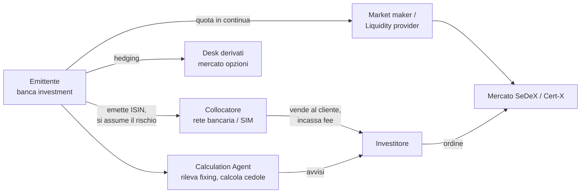
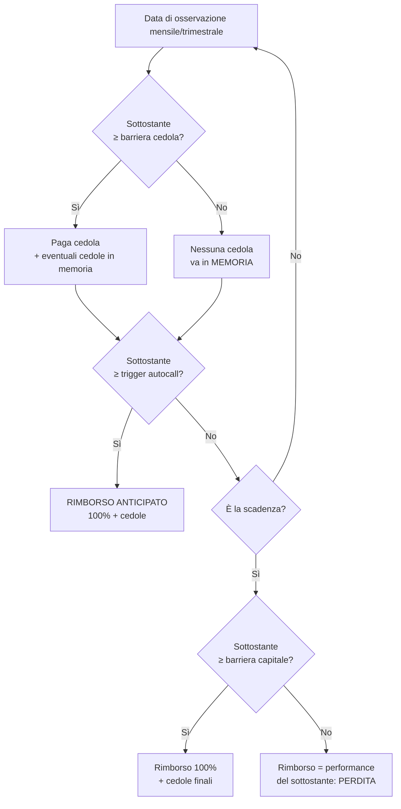
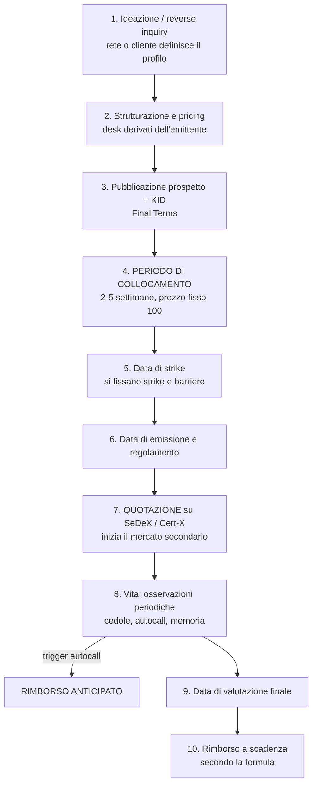
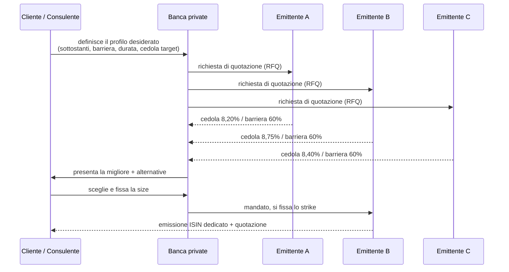

# Investment Certificates — Guida completa

> **Documento formativo, aggiornato a settembre 2026.** Non è consulenza finanziaria né
> sollecitazione all'investimento. I certificates sono strumenti complessi: prima di operare
> leggere sempre **KID**, **prospetto di base** e **condizioni definitive (Final Terms)**
> dello specifico ISIN. I numeri usati negli esempi sono verosimili ma **inventati a scopo
> didattico**: le condizioni reali cambiano ogni giorno con tassi, volatilità e dividendi.
>
> 🇬🇧 English version: [`certificates-complete-guide-en.md`](./certificates-complete-guide-en.md)

---

## Indice

1. [Che cos'è un certificate](#1-che-cosè-un-certificate)
2. [Gli attori della filiera](#2-gli-attori-della-filiera)
3. [Anatomia: tutte le variabili di un certificato](#3-anatomia-tutte-le-variabili-di-un-certificato)
4. [I mattoncini: call, put, in the money, opzioni esotiche](#4-i-mattoncini-call-put-in-the-money-opzioni-esotiche)
5. [Tassonomia: le 4 famiglie ACEPI](#5-tassonomia-le-4-famiglie-acepi)
6. [Le tipologie, una per una, con schemi di payoff](#6-le-tipologie-una-per-una-con-schemi-di-payoff)
7. [Le barriere: la variabile che decide tutto](#7-le-barriere-la-variabile-che-decide-tutto)
8. [I meccanismi accessori: memoria, autocall, step-down, worst-of, airbag, cap](#8-i-meccanismi-accessori)
9. [Come nasce il prezzo: la scomposizione finanziaria](#9-come-nasce-il-prezzo-la-scomposizione-finanziaria)
10. [Le greche e le leve del valore](#10-le-greche-e-le-leve-del-valore)
11. [Ciclo di vita: dal primario al rimborso](#11-ciclo-di-vita-dal-primario-al-rimborso)
12. [L'acquisto operativo: dove, come, a che prezzo](#12-lacquisto-operativo-dove-come-a-che-prezzo)
13. [La trattativa: retail, private, istituzionale](#13-la-trattativa-retail-private-istituzionale)
14. [Le piazze di quotazione](#14-le-piazze-di-quotazione)
15. [Fiscalità italiana e compensazione delle minusvalenze](#15-fiscalità-italiana-e-compensazione-delle-minusvalenze)
16. [Come si generano ricavi — lato investitore](#16-come-si-generano-ricavi--lato-investitore)
17. [Come si generano ricavi — lato emittente, collocatore, consulente](#17-come-si-generano-ricavi--lato-emittente-collocatore-consulente)
18. [I rischi, senza sconti](#18-i-rischi-senza-sconti)
19. [Tre casi numerici completi](#19-tre-casi-numerici-completi)
20. [Checklist operativa pre-acquisto](#20-checklist-operativa-pre-acquisto)
21. [Glossario](#21-glossario)

---

## 1. Che cos'è un certificate

Un **certificate** (in italiano *certificato di investimento*) è un **titolo di debito
cartolarizzato che incorpora uno o più contratti derivati**. Tecnicamente è una
*securitised derivative*: l'emittente (una banca) emette un titolo con un ISIN, negoziabile
in borsa come un'azione, il cui rimborso non è fisso ma **dipende da una formula** legata
all'andamento di un sottostante.

Tre affermazioni da tenere insieme:

| Il certificate **è** | Il certificate **non è** |
|---|---|
| Un titolo di debito della banca emittente | Un fondo, un ETF, una quota di patrimonio separato |
| Un contenitore di opzioni, confezionato per il retail | Un deposito (nessuna tutela FITD 100.000 €) |
| Uno strumento a scadenza, con formula predefinita | Una gestione attiva: nessuno "decide" nulla dopo l'emissione |

### L'equazione fondamentale

Ogni certificate, senza eccezioni, si scompone così:

```
CERTIFICATE  =  OBBLIGAZIONE ZERO COUPON dell'emittente
                +  PORTAFOGLIO DI OPZIONI (comprate e/o vendute)
                −  MARGINE DELL'EMITTENTE E DEL COLLOCATORE
```

Da questa equazione discende **tutto** il resto del documento: se capisci quali opzioni
sono dentro, sai già come si comporterà lo strumento, da cosa dipende il suo prezzo e
dove stanno i ricavi (tuoi e della banca).

### Perché esistono

Perché permettono di **comprare un profilo di rischio/rendimento che con azioni e
obbligazioni da sole non esiste**. Esempi di bisogni reali:

- "Voglio esposizione all'azionario ma **con un cuscinetto del -40%**" → capitale condizionatamente protetto.
- "Voglio un **flusso cedolare del 9%** e accetto di perdere se il titolo crolla" → cash collect.
- "Ho **150.000 € di minusvalenze** in scadenza e devo generare plusvalenze compensabili" → uso fiscale.
- "Voglio esposizione a un paniere di 3 titoli senza comprare i 3 titoli" → worst-of.
- "Voglio proteggere il capitale nominale a 5 anni ma partecipare al rialzo" → equity protection.

---

## 2. Gli attori della filiera



| Attore | Ruolo | Come guadagna |
|---|---|---|
| **Emittente** | Emette il titolo, si assume l'obbligo di rimborso, copre il rischio sul mercato opzioni | Margine di strutturazione + P&L di hedging |
| **Collocatore** | Distribuisce ai clienti in fase di primario | Commissione di collocamento (upfront, 1–4%) |
| **Calculation Agent** | Rileva i fixing, verifica barriere, calcola cedole e rimborso | È di norma l'emittente stesso (potenziale conflitto di interesse) |
| **Market maker / Liquidity provider** | Espone prezzi denaro/lettera in continua sul mercato | Spread bid/ask |
| **Borsa / MTF** (SeDeX, Cert-X, Vorvel) | Fornisce il mercato regolamentato/MTF | Fee di quotazione e negoziazione |
| **Investitore** | Compra il profilo di payoff | Cedole, rimborso, plusvalenze, risparmio fiscale |

> ⚠️ **Nota di struttura**: nella maggior parte dei casi emittente, calculation agent e
> market maker **sono lo stesso gruppo bancario**. È la principale asimmetria del mercato:
> chi ti vende lo strumento è anche chi ne calcola il valore e ne fa il prezzo sul secondario.

---

## 3. Anatomia: tutte le variabili di un certificato

Ogni certificate è descritto da una lista di parametri. Impararli è il 70% del lavoro.

| Variabile | Significato | Esempio tipico |
|---|---|---|
| **ISIN** | Codice identificativo univoco | `XS2XXXXXXXXX`, `DE000XXXXXXX`, `IT000XXXXXXX` |
| **Emittente** | Chi paga a scadenza | BNP Paribas, Société Générale, Vontobel, Leonteq, Marex, UniCredit, Intesa, Mediobanca, Barclays, Citi, Goldman Sachs, J.P. Morgan, Natixis, Banca Akros |
| **Sottostante** (*underlying*) | Azione, indice, paniere, ETF, commodity, tasso, valuta, crypto | Eni; Euro Stoxx 50; {Eni, Intesa, Stellantis} |
| **Nominale** (*denomination*) | Valore facciale di un certificato | 100 € o 1.000 € |
| **Prezzo di emissione** | Quanto paghi sul primario | 100 (= 100% del nominale) |
| **Strike / Valore iniziale** | Prezzo del sottostante rilevato alla data di strike | Eni = 14,00 € |
| **Barriera capitale** | Soglia sotto la quale la protezione salta | 60% dello strike = 8,40 € |
| **Barriera cedola** | Soglia per incassare la cedola | 70% dello strike = 9,80 € |
| **Tipo di osservazione barriera** | Continua (americana) o finale (europea) | Finale (la più diffusa oggi in Italia) |
| **Cedola** | Importo periodico condizionato o incondizionato | 0,75% mensile = 9% annuo |
| **Effetto memoria** | Le cedole non pagate si accumulano e si recuperano | Sì / No |
| **Autocall** (*rimborso anticipato*) | Soglia oltre la quale il titolo si estingue in anticipo | 100% dal 12° mese |
| **Trigger step-down** | L'autocall si abbassa nel tempo | −2,5% ogni trimestre |
| **Bonus / Cap** | Rimborso minimo garantito condizionato / tetto massimo | Bonus 118%, Cap 118% |
| **Partecipazione** | % di partecipazione al movimento del sottostante | 70%, 100%, 150% |
| **Scadenza** (*maturity*) | Data di rimborso finale | 3 anni |
| **Data di valutazione finale** | Quando si rileva il valore che decide il rimborso | 5 giorni lavorativi prima della scadenza |
| **Multiplo / Parità** | Quanti sottostanti "rappresenta" un certificato | Nominale / Strike |
| **Valuta e Quanto** | Valuta di denominazione e copertura cambio | EUR; *quanto* = rischio cambio neutralizzato |
| **Lotto minimo** | Quantità minima negoziabile | 1 certificato |
| **Mercato di quotazione** | Dove si scambia | SeDeX, Cert-X (EuroTLX), Vorvel |

---

## 4. I mattoncini: call, put, in the money, opzioni esotiche

### 4.1 Call e put in 30 secondi

| | **CALL** | **PUT** |
|---|---|---|
| Dà il diritto di | **comprare** a strike K | **vendere** a strike K |
| Chi la **compra** guadagna se | il sottostante **sale** | il sottostante **scende** |
| Chi la **vende** incassa | un premio subito, rischia se sale | un premio subito, **rischia se scende** |

```
         PAYOFF CALL COMPRATA                    PAYOFF PUT VENDUTA
   utile |            /                    utile |________
         |           /                           |        \
       0 |__________/______  sottostante       0 |________ \______  sottostante
         |         K                             |        K \
  perdita|                                perdita|           \
   (perdita max = premio)                 (perdita potenzialmente enorme)
```

> 🔑 **Il concetto chiave di tutto il mercato dei certificates**: quando compri un
> certificate ad alta cedola (cash collect, phoenix, reverse convertible, bonus) **tu stai
> vendendo una put** all'emittente. La cedola alta non è un regalo: è il **premio della
> put che hai venduto**. Alta cedola = put venduta cara = rischio alto. Sempre.

### 4.2 In the money, at the money, out of the money

| Stato | Call | Put | In gergo certificates |
|---|---|---|---|
| **ITM** (*in the money*) | Sottostante **> strike** | Sottostante **< strike** | "il certificato è in the money" = il sottostante è **sopra** strike/barriera → scenario favorevole |
| **ATM** (*at the money*) | Sottostante ≈ strike | Sottostante ≈ strike | massima incertezza, massima gamma, prezzo nervosissimo |
| **OTM** (*out of the money*) | Sottostante **< strike** | Sottostante **> strike** | sottostante sotto barriera → scenario sfavorevole |

Il **valore di un'opzione** = *valore intrinseco* (quanto è ITM oggi) + *valore temporale*
(probabilità che migliori). Il valore temporale si consuma col tempo (**theta**) e si azzera
a scadenza: è il motivo per cui un certificate vicino a scadenza si muove in modo
quasi binario.

### 4.3 Le opzioni esotiche che troverai dentro i certificates

| Opzione | Cosa fa | Dove la trovi |
|---|---|---|
| **Down-and-in put** | Diventa viva solo se il sottostante tocca/scende sotto la barriera | Barriera capitale di cash collect, phoenix, bonus |
| **Down-and-out put** | Muore se la barriera viene toccata | Bonus, twin win |
| **Digitale (binaria)** | Paga un importo fisso se una condizione è vera, 0 altrimenti | Ogni cedola condizionata |
| **Zero-strike call** | Replica il sottostante **senza dividendi** | Base di quasi tutti i certificati su azioni |
| **Call spread** | Long call K1 + short call K2 | Qualsiasi struttura con **cap** |
| **Worst-of option** | Guarda solo il peggiore di N sottostanti | Multi-underlying |
| **Knock-out / Turbo** | Si estingue senza valore se tocca un livello | Certificati a leva |
| **Lookback / Asian** | Usa media o massimo/minimo del periodo | Strutture "average", protezione da timing |

---

## 5. Tassonomia: le 4 famiglie ACEPI

ACEPI (Associazione Italiana Certificati e Prodotti di Investimento) classifica il mercato
in 4 macro-famiglie. È la mappa da tenere a mente.

```
                        CERTIFICATES
                              │
   ┌──────────────┬───────────┴───────────┬────────────────┐
   │              │                       │                │
 CAPITALE      CAPITALE              CAPITALE           A LEVA
 PROTETTO   COND. PROTETTO         NON PROTETTO      (leverage)
   │              │                       │                │
Equity Prot.   Cash Collect          Benchmark        Turbo / Mini future
Digital        Phoenix               Tracker          Leva Fissa
Butterfly      Express               Outperformance   Covered Warrant
Cap. Prot.     Bonus / Bonus Cap     (senza barriera)
  con cedola   Reverse Convertible
               Twin Win
               Airbag
   │              │                       │                │
 rischio ↑     rischio ↑↑             rischio ↑↑↑     rischio ↑↑↑↑↑
 orizzonte     orizzonte 2-5 anni     orizzonte       orizzonte
 3-7 anni                             variabile       intraday/settimane
```

| Famiglia | Protezione | Chi la usa | Rendimento atteso tipico |
|---|---|---|---|
| **Capitale protetto** | 100% (o 90/95%) del nominale **a scadenza**, salvo default emittente | Chi sostituisce un'obbligazione | 2–5% annuo |
| **Capitale condizionatamente protetto** | Solo se non si viola la barriera | Il 70–80% del mercato retail italiano | 5–12% annuo |
| **Capitale non protetto** | Nessuna | Chi vuole replica o leva sul sottostante | = sottostante ± partecipazione |
| **A leva** | Nessuna, con knock-out | Trader di brevissimo periodo | ±100% in giorni |

---

## 6. Le tipologie, una per una, con schemi di payoff

Legenda degli schemi: asse orizzontale = valore del **sottostante a scadenza** in % dello
strike; asse verticale = **rimborso** in % del nominale.

---

### 6.1 Equity Protection (capitale protetto)

**A cosa serve**: proteggere il nominale e partecipare al rialzo.
**Composizione**: `ZC bond (100 a scadenza) + call ATM × partecipazione [− call al cap]`

```
rimborso %
  160 |                          _________________  ← CAP 160%
      |                        /
  130 |                      /   ← pendenza = partecipazione (es. 70%)
      |                    /
  100 |________________ /        ← PROTEZIONE: sotto 100 rimborsi comunque 100
      |
      +----|---------|---------|---------|-------→ sottostante a scadenza
          50        100       150       200
```

- **Pro**: dormi la notte; nominale protetto salvo default emittente.
- **Contro**: rinunci ai dividendi (è così che si paga la protezione), partecipazione < 100%,
  protezione valida **solo a scadenza** (durante la vita può quotare 85), durate lunghe (5–7 anni).
- **Variante Digital**: invece della partecipazione, una cedola fissa se l'indice è sopra un
  livello (es. +6% se Euro Stoxx ≥ strike, altrimenti 100).

---

### 6.2 Bonus e Bonus Cap (capitale condizionatamente protetto)

**A cosa serve**: ottenere un rendimento fisso anche se il sottostante scende, purché non
sfondi la barriera.
**Composizione**: `zero-strike call + down-and-out put (strike = bonus) [− call al cap]`

```
rimborso %
  118 |_________________________          ← BONUS = CAP 118%
      |                         |
  100 |                         |
      |         (se barriera    |
   70 |  ....... NON violata) . |
      |      /                  |
   50 |    /   ← se barriera violata segui il sottostante 1:1
      +--|-----|--------|-------|-----→ sottostante a scadenza
        50    70(BAR)  100     118
```

**Regola di lettura**: guadagni **+18% anche se il titolo perde il 29%**. Perdi solo se
perde più del 30% (barriera). In cambio, rinunci a tutto il rialzo sopra 118 (cap).

---

### 6.3 Cash Collect (il best-seller italiano)

**A cosa serve**: trasformare un'azione volatile in una **rendita periodica**.
**Composizione**: `ZC bond + serie di opzioni digitali (cedole) − down-and-in put (barriera) [+ meccanismo autocall]`



- **Cedole**: 0,5–1,5% al mese, o 2–4% a trimestre. Su worst-of di titoli volatili si vedono
  cedole 10–15% annue.
- **Vita media reale**: molto più corta della scadenza nominale, per via dell'autocall
  (moltissimi cash collect si estinguono entro 12–18 mesi).
- **Il rischio vero**: la *down-and-in put* venduta. Se il worst-of crolla, rimborsi in
  proporzione alla sua perdita.

---

### 6.4 Phoenix

Variante del cash collect in cui la **cedola ha una barriera più bassa** del capitale (o
comunque la struttura è pensata per "risorgere": anche dopo mesi senza cedola, se il
sottostante risale sopra barriera si riprende a incassare, e con **memoria** si recupera
tutto l'arretrato). Nel linguaggio commerciale italiano *Phoenix* e *Cash Collect con
memoria* sono ormai quasi sinonimi.

---

### 6.5 Express

Struttura **focalizzata sul rimborso anticipato**: niente (o poche) cedole periodiche,
ma un **premio crescente** incassato in un colpo solo quando scatta l'autocall.

```
Anno 1: sottostante ≥ 100% → rimborso 100 + 8   = 108
Anno 2: sottostante ≥  95% → rimborso 100 + 16  = 116   (premio cumulato)
Anno 3: sottostante ≥  90% → rimborso 100 + 24  = 124
Scadenza: se ≥ barriera 60% → 100 + 32 = 132; altrimenti segui il sottostante
```

---

### 6.6 Reverse Convertible

Il capostipite, il più "onesto" nella sua brutalità: **cedola fissa alta incondizionata**,
rimborso 100 solo se il sottostante è sopra strike, altrimenti **consegna delle azioni** (o
equivalente in denaro).
**Composizione**: `bond + short put ATM`. È letteralmente una put venduta con la cedola come premio.

---

### 6.7 Twin Win ("doppia vittoria")

Guadagni **sia se sale sia se scende**, purché non si violi la barriera: la performance
negativa viene trasformata in positiva in valore assoluto.
**Composizione**: `zero-strike call + 2 × down-and-out put ATM`

```
rimborso %
  140 |          \           /
      |           \        /
  120 |            \     /
  100 |             \  /
      |   (sotto barriera: crolli col sottostante)
      +----|--------|--------|--------|---→
          60(BAR)  80       100      140
           ↑ performance −20% → rimborso 120
```

---

### 6.8 Outperformance

Partecipazione **superiore al 100%** al rialzo (es. 150%), a fronte della rinuncia ai
dividendi e di una partecipazione 1:1 al ribasso.
**Composizione**: `zero-strike call + 0,5 × call ATM` (per una partecipazione 150%).

---

### 6.9 Benchmark / Tracker

Replica lineare e semplice del sottostante, utile per accedere a mercati altrimenti
difficili (indici esotici, panieri tematici, materie prime). Nessuna barriera, nessuna
protezione. **Attenzione**: rischio emittente su uno strumento che sembra un ETF ma non lo è.

---

### 6.10 Certificati a leva: Turbo, Mini Future, Leva Fissa

| Tipo | Meccanica | Rischio specifico |
|---|---|---|
| **Turbo / Mini Future** | Leva variabile data dal finanziamento implicito; **knock-out** se il sottostante tocca il livello barriera → il titolo si estingue (spesso a zero o a un residuo) | Knock-out istantaneo, gap overnight |
| **Leva Fissa** (×3, ×5, ×7) | Leva costante **giornaliera** | **Compounding/erosione**: in mercati laterali-volatili perdi anche se il sottostante torna al punto di partenza |

> Esempio di erosione della leva fissa ×5: giorno 1 il sottostante fa +10% → certificato
> +50% (da 100 a 150). Giorno 2 il sottostante fa −9,09% (torna al valore iniziale) →
> certificato −45,45% → **81,8**, non 100. Il sottostante è pari, tu hai perso il 18%.

---

## 7. Le barriere: la variabile che decide tutto

### 7.1 Tipi di osservazione

| Tipo | Come funziona | Effetto sul rischio | Effetto sulle condizioni |
|---|---|---|---|
| **Europea / finale** (*at maturity*) | Si guarda **solo alla data di valutazione finale** | 🟢 Molto più sicura: un crollo temporaneo non conta | Cedole più basse |
| **Americana / continua** (*intraday*) | Basta **un solo istante** sotto barriera in tutta la vita | 🔴 Pericolosissima: un flash crash brucia la protezione | Cedole più alte |
| **Discreta** | Si osserva solo a date prefissate (es. fine mese) | 🟡 Via di mezzo | Intermedia |

> ✅ **Regola pratica**: nel retail italiano oggi domina la **barriera europea/finale**.
> Se ti propongono una barriera **continua**, la cedola deve essere significativamente più
> alta per giustificare il rischio. Verifica SEMPRE questo campo nel KID: è la differenza
> tra dormire e non dormire.

### 7.2 Barriera capitale vs barriera cedola

```
 100% ─────────────── STRIKE (valore iniziale) ── riferimento di tutto
  95% ─ ─ ─ ─ ─ ─ ─ ─ trigger AUTOCALL (spesso con step-down)
  70% ─ ─ ─ ─ ─ ─ ─ ─ BARRIERA CEDOLA  → sopra: incassi. sotto: memoria
  60% ═══════════════ BARRIERA CAPITALE → sotto a scadenza: PERDI in proporzione
```

### 7.3 L'effetto "cliff" (rischio digitale)

La barriera crea una **discontinuità**: a scadenza, 59,9% e 60,1% del sottostante producono
rimborsi di 59,9 e 100. È la ragione per cui:

- Vicino alla barriera e vicino alla scadenza il prezzo del certificato diventa **ipersensibile**;
- Il market maker allarga lo spread proprio quando vorresti uscire;
- Non conviene mai comprare un certificato "appena sopra barriera" pensando che sia a sconto:
  stai comprando una moneta lanciata in aria.

### 7.4 Distanza dalla barriera = il vero indicatore di rischio

| Distanza dalla barriera | Lettura |
|---|---|
| > 45% | Molto conservativo — cedola bassa |
| 30–45% | Equilibrato (la zona più comune) |
| 15–30% | Aggressivo |
| < 15% | Sei sostanzialmente lungo l'azione, con il cap del rendimento |

---

## 8. I meccanismi accessori

| Meccanismo | Cosa fa | Effetto per te |
|---|---|---|
| **Memoria** | Le cedole non pagate si accumulano e vengono corrisposte alla prima osservazione utile | 🟢 Molto favorevole: trasforma un "non pagato" in un "pagato dopo" |
| **Autocall** | Rimborso anticipato al 100% se il sottostante è sopra il trigger | 🟡 Ti chiude l'operazione quando va bene (rischio di reinvestimento) |
| **Step-down / Step-up** | Il trigger di autocall scende (o sale) nel tempo | 🟢 Step-down aumenta la probabilità di richiamo |
| **Worst-of** | La formula guarda solo il **peggiore** degli N sottostanti | 🔴 Aumenta molto il rischio: basta che uno solo crolli |
| **Best-of / Rainbow** | Guarda il migliore | 🟢 Raro e costoso |
| **Airbag** | Sotto barriera la perdita è attenuata: si riparametra sul livello barriera invece che sullo strike | 🟢 Ammortizza il "salto" |
| **Cap** | Tetto massimo al rimborso | 🔴 Rinunci al rialzo, ma è ciò che finanzia il resto |
| **Low Strike** | Lo strike è fissato sotto il prezzo corrente (es. 50%) | 🟢 Profilo ultra-difensivo, cedole basse |
| **Quanto** | Neutralizza il rischio cambio | 🟡 Costa in termini di condizioni |
| **Protezione Bonus** | Bonus riconosciuto anche senza cedole | — |

### 8.1 Perché il worst-of paga così tanto (e perché è insidioso)

Con 3 sottostanti, la probabilità che **almeno uno** violi la barriera è molto più alta
della probabilità che ne violi uno solo scelto a priori.

```
P(barriera violata) con barriera 60% a 3 anni, volatilità 30%:
  1 sottostante  →  ~18%
  3 sottostanti indipendenti →  ~1 − (0,82)³  ≈  45%
```

Ecco perché la cedola sale da ~5% a ~10%: **ti stanno pagando per un rischio molto maggiore**.
E c'è una seconda variabile:

| Correlazione tra i sottostanti | Prezzo della put worst-of | Cedola offerta | Rischio reale |
|---|---|---|---|
| Alta (titoli dello stesso settore) | Più bassa | Più bassa | Più basso (si muovono insieme) |
| **Bassa** (settori/paesi diversi) | **Più alta** | **Più alta** | **Più alto** (basta un anello debole) |

> 🔑 Se vedi un worst-of con cedola fuori mercato, guarda i sottostanti: quasi sempre
> c'è **un titolo debole o molto volatile** che sta "pagando" la cedola di tutti.

---

## 9. Come nasce il prezzo: la scomposizione finanziaria

Questo è il capitolo che separa chi compra certificates da chi li capisce.

### 9.1 Esempio di scomposizione (Cash Collect 3 anni, nominale 100)

| Componente | Chi la compra/vende | Valore |
|---|---|---|
| **Obbligazione zero coupon** (rimborso 100 a 3 anni, tasso risk-free 3% + credit spread emittente 0,8%) | L'investitore la compra | **+89,4** |
| **Opzioni digitali** (36 cedole mensili condizionate 0,75%) | L'investitore le compra | **+14,0** |
| **Down-and-in put** (strike 100, barriera 60%, worst-of) | L'investitore la **vende** → incassa premio | **−9,0** |
| **= Fair value teorico alla data di emissione** | | **= 94,4** |
| **Prezzo pagato dall'investitore sul primario** | | **100,0** |
| **Differenza = margine emittente + commissione di collocamento** | | **5,6 (5,6%)** |

### 9.2 Le tre conseguenze pratiche

1. **Il "day-2 drop"**: il giorno dopo l'emissione il market maker quota vicino al fair value.
   È normale vedere il prezzo scendere a 96–98. **Non è un errore: è il costo di
   distribuzione che esce allo scoperto.**
2. **Comprare sul secondario conviene quasi sempre**: sul mercato non paghi la commissione
   di collocamento, paghi solo lo spread bid/ask (tipicamente 0,3–1%).
3. **Il rendimento promesso va sempre confrontato col rischio venduto**: se la put che hai
   venduto vale 9 e le cedole valgono 14, il tuo "extra rendimento" reale rispetto al
   risk-free è molto più modesto di quanto suggerisca il "9% annuo" in copertina.

### 9.3 Da cosa dipendono le condizioni offerte

| Variabile di mercato | Se aumenta... | Effetto sulle condizioni per te |
|---|---|---|
| **Tassi d'interesse** | ↑ | 🟢 Migliori (lo ZC bond costa meno, resta più budget per le opzioni) |
| **Volatilità implicita** | ↑ | 🟢 Migliori (la put che vendi vale di più) |
| **Dividend yield del sottostante** | ↑ | 🟢 Migliori (i dividendi che rinunci finanziano la struttura) |
| **Credit spread dell'emittente** | ↑ | 🟢 Migliori... ma 🔴 aumenta il rischio di controparte |
| **Correlazione (su worst-of)** | ↓ | 🟢 Cedole più alte, 🔴 rischio più alto |
| **Durata** | ↑ | 🟢 Più budget, 🔴 più rischio e meno liquidità |

> 📌 **Timing**: i momenti migliori per **comprare** certificates yield enhancement sono
> quelli di **volatilità alta e tassi alti** (crisi, panico, VIX elevato). È esattamente
> quando l'istinto dice di stare fermi.

---

## 10. Le greche e le leve del valore

Durante la vita del certificato il prezzo si muove per queste sensibilità:

| Greca | Misura | Nel certificate |
|---|---|---|
| **Delta** | Sensibilità al sottostante | Basso (0,1–0,3) quando sei molto sopra barriera; sale verso 1 avvicinandosi alla barriera |
| **Gamma** | Velocità di variazione del delta | **Esplode vicino alla barriera e vicino alla scadenza** → prezzo instabile |
| **Vega** | Sensibilità alla volatilità | **Negativo** nella maggior parte dei certificati a cedola (hai venduto opzioni): se la volatilità sale, il tuo certificato scende |
| **Theta** | Erosione temporale | **Positivo** per chi ha venduto opzioni: il tempo che passa lavora per te |
| **Rho** | Sensibilità ai tassi | Rilevante sulle strutture lunghe a capitale protetto |
| **Sensibilità al credit spread** | Rischio emittente | Se il mercato teme l'emittente, il certificato scende **anche se il sottostante è fermo** |
| **Sensibilità alla correlazione** | Solo worst-of | Correlazione in calo → il tuo certificato perde valore |

**Traduzione operativa**: un cash collect è, in termini di rischio, **una posizione corta
di volatilità e lunga di tempo**. Guadagni se non succede nulla. Perdi quando il mercato
si muove violentemente al ribasso.

---

## 11. Ciclo di vita: dal primario al rimborso



### Le date da segnare in calendario

| Data | Perché conta |
|---|---|
| **Fine collocamento** | Ultimo giorno per sottoscrivere sul primario |
| **Data di strike** | Fissa strike e barriere: da qui in poi tutto è determinato |
| **Date di osservazione** | Cedole e autocall: il prezzo salta in prossimità di queste date |
| **Data di stacco cedola** | Il certificato quota **tel quel**: il giorno dello stacco il prezzo scende dell'importo della cedola. Non è una perdita. |
| **Data di valutazione finale** | È qui che si decide il rimborso, **non** alla scadenza |
| **Data di scadenza/pagamento** | Accredito (di norma 3–5 giorni lavorativi dopo la valutazione) |

---

## 12. L'acquisto operativo: dove, come, a che prezzo

### 12.1 Le due strade

```
              ┌─────────────────────────────┐        ┌────────────────────────────┐
              │   MERCATO PRIMARIO           │        │   MERCATO SECONDARIO       │
              │   (collocamento)             │        │   (borsa)                  │
              ├─────────────────────────────┤        ├────────────────────────────┤
 Prezzo       │ fisso 100 (nominale)         │        │ quotazione denaro/lettera  │
 Costi        │ commissione collocamento     │        │ spread bid/ask + commiss.  │
              │ 1-4% INCLUSA nel prezzo      │        │ di negoziazione broker     │
 Finestra     │ 2-5 settimane                │        │ ogni giorno, 9:00-17:30    │
 Condizioni   │ indicative fino allo strike  │        │ tutto già noto e verific.  │
 Vantaggio    │ "prendi il nuovo, allo str.  │        │ 🟢 paghi meno              │
              │  di mercato di oggi"         │        │ 🟢 vedi la distanza vera   │
              │                              │        │    dalla barriera          │
              └─────────────────────────────┘        └────────────────────────────┘
```

### 12.2 Passi concreti per comprare sul secondario

1. **Trova l'ISIN** (sito emittente, sezione certificates di Borsa Italiana, comparatori).
2. **Scarica e leggi il KID** (3 pagine): indicatore di rischio SRI 1–7, scenari di
   performance, costi, periodo di detenzione raccomandato.
3. **Leggi i Final Terms** per strike, barriere esatte, tipo di osservazione, date.
4. **Verifica lo stato attuale**: dove sta il sottostante rispetto a strike e barriera *oggi*.
5. **Guarda il book**: spread denaro/lettera, quantità esposte, presenza del market maker.
6. **Inserisci un ordine LIMITE** (mai "al meglio" su certificates: la liquidità la fa quasi
   solo il market maker e uno spread largo ti mangia il rendimento).
7. **Prova a "entrare nello spread"**: se il book è 98,50 / 99,00, metti un limite a 98,75.
   Spesso viene eseguito: è la forma di trattativa disponibile al retail.
8. **Regolamento T+2** (settlement standard europeo; l'UE è attesa al passaggio a T+1 nel 2027).
9. **Monitoraggio**: segna in calendario le date di osservazione e controlla la distanza
   dalla barriera, non il prezzo di carico.

### 12.3 Costi totali da mettere a bilancio

| Voce | Ordine di grandezza |
|---|---|
| Commissione di collocamento (solo primario) | 1–4% una tantum, incorporata nel prezzo |
| Margine di strutturazione dell'emittente | 1–3% incorporato |
| Spread denaro/lettera sul secondario | 0,2–1,5% (più largo su titoli illiquidi o vicini a barriera) |
| Commissione di negoziazione del broker | 0,1–0,5%, spesso con minimo/massimo fisso |
| Imposta di bollo titoli | 0,20% annuo sul controvalore |
| Tassazione | 26% sui redditi |

---

## 13. La trattativa: retail, private, istituzionale

Esistono **tre livelli** di negoziazione, molto diversi tra loro.

### 13.1 Retail — la trattativa è nel prezzo, non nelle condizioni

Sul primario **non si tratta nulla**: il prodotto è confezionato, prendere o lasciare.
La sola leva è: **scegliere un altro prodotto**. Sul secondario, invece:

- **Ordine limite dentro lo spread** → tratti con il market maker;
- **Frazionare l'ordine** su più giorni per non subire lo spread su tutto il controvalore;
- **Evitare gli orari di apertura/chiusura**, quando gli spread sono più larghi;
- **Chiedere al broker** se applica sconti su volumi o ha accesso diretto a più venue.

### 13.2 Private banking / Family office — il certificato su misura

Sopra una certa soglia di controvalore (indicativamente **500.000 – 1.000.000 €**, con
soglia più bassa se aggregata in *club deal*), si passa al **tailor made**:



**Cosa è negoziabile in questa fase (e questo è il punto centrale della "trattativa")**:

| Leva | Come si negozia |
|---|---|
| **Livello della cedola** | Si abbassa la barriera o si allunga la durata per alzarla |
| **Livello della barriera** | Si accetta una cedola minore per una barriera più profonda |
| **Composizione del paniere** | Togliere il titolo più volatile abbassa la cedola ma riduce molto il rischio |
| **Tipo di osservazione barriera** | Chiedere sempre **europea/finale** |
| **Memoria e airbag** | Da chiedere esplicitamente: costano poco e valgono molto |
| **Trigger di autocall e step-down** | Determina la vita attesa dell'investimento |
| **Commissione di collocamento** | 🔑 **La voce più negoziabile di tutte**: farla scendere da 3% a 1% migliora direttamente le tue condizioni |
| **Multi-emittente (competizione)** | Mettere 3 emittenti in concorrenza vale tipicamente 30–80 bps di cedola |

### 13.3 Istituzionale — reverse inquiry e private placement

Fondi, assicurazioni e casse previdenziali comprano tramite **reverse inquiry**: specificano
il payoff desiderato, ricevono quotazioni OTC, chiudono via ISDA o su nota strutturata
(EMTN programme). Qui la trattativa è pura: prezzo, size, collateral, diritto di unwind,
livelli di mid-market documentati. Taglio minimo tipico: 1–5 milioni.

---

## 14. Le piazze di quotazione

### 14.1 Italia

| Mercato | Gestore | Caratteristiche |
|---|---|---|
| **SeDeX** | Borsa Italiana (gruppo Euronext) — MTF | Il mercato storico dei certificati e covered warrant. Market maker con obblighi di quotazione continua (spread massimo e quantità minima). Orario indicativo **9:00–17:30**. |
| **Cert-X** (segmento di **EuroTLX**) | Borsa Italiana / Euronext — MTF | Molto usato per i certificati collocati dalle reti bancarie. Stessa logica di market making. |
| **Vorvel** (ex Hi-MTF) | Vorvel SIM | Segmento dedicato, usato da alcuni emittenti e reti. |
| **OTC / internalizzatori** | Singole banche | Alcune reti trattano internamente i propri certificati fuori mercato. |

> L'Italia è, in termini di numero di strumenti quotati e di partecipazione retail, **uno
> dei mercati dei certificates più sviluppati d'Europa**. Fonti di riferimento per dati e
> statistiche: report periodici **ACEPI** e statistiche di **Borsa Italiana**.

### 14.2 Europa

| Piazza | Paese | Note |
|---|---|---|
| **EUWAX (Börse Stuttgart)** | Germania | Il più grande mercato retail europeo per prodotti strutturati |
| **Börse Frankfurt Zertifikate** | Germania | Enorme offerta di turbo e leva |
| **SIX Structured Products** | Svizzera | Standard SSPA, forte su barrier reverse convertible |
| **Euronext (Parigi, Amsterdam, Bruxelles)** | Francia/Benelux | Ampia offerta di warrant e certificati |
| **SpectrumMarkets** | Pan-europeo | Trading 24/5 su turbo |

### 14.3 Obblighi del market maker (perché contano per te)

Il liquidity provider si impegna, secondo il regolamento di mercato, a:
- esporre **contemporaneamente** prezzi in denaro e in lettera;
- rispettare uno **spread massimo** e un **quantitativo minimo**;
- quotare per una **percentuale minima della seduta**.

Può **sospendere le quotazioni** in casi eccezionali (sospensione del sottostante, eventi di
mercato estremi, esaurimento dell'emissione). È esattamente il momento in cui vorresti
uscire: mettilo nel conto del rischio di liquidità.

---

## 15. Fiscalità italiana e compensazione delle minusvalenze

> ⚠️ La materia fiscale evolve: quanto segue è l'impianto generale, **da verificare con il
> proprio intermediario e con la normativa vigente** al momento dell'operazione.

### 15.1 Il quadro

| Aspetto | Trattamento |
|---|---|
| **Natura dei proventi** | I certificates sono **derivati cartolarizzati**: i proventi (cedole, premi, differenziali, plusvalenze) sono di norma **"redditi diversi"** ex art. 67 TUIR |
| **Aliquota** | **26%** (12,5% sulla quota riferibile a titoli di Stato e white list, ove applicabile) |
| **Compensazione** | 🔑 **I redditi diversi si compensano con le minusvalenze pregresse** |
| **Orizzonte di compensazione** | Minusvalenze utilizzabili nell'anno di realizzo **e nei 4 successivi** |
| **Regimi** | Amministrato (banca sostituto d'imposta) o dichiarativo |
| **Imposta di bollo** | **0,20% annuo** sul controvalore in deposito titoli |
| **Caso da verificare** | Su certificati a **capitale integralmente e incondizionatamente protetto** il trattamento di alcune componenti può essere diverso: leggere il prospetto e chiedere all'intermediario |

### 15.2 Perché questo è il vero "asso" dei certificates in Italia

```
        STRUMENTO                    NATURA DEI PROVENTI       COMPENSA LE MINUSVALENZE?
  ───────────────────────────────────────────────────────────────────────────────────────
  Cedola di obbligazione        →  reddito di CAPITALE     →   ❌ NO
  Dividendo azionario           →  reddito di CAPITALE     →   ❌ NO
  Distribuzione di ETF/fondo    →  reddito di CAPITALE     →   ❌ NO
  Plusvalenza su ETF/fondo      →  reddito di CAPITALE     →   ❌ NO (in Italia!)
  Plusvalenza su azione         →  reddito DIVERSO         →   ✅ SÌ
  CEDOLE E PROVENTI CERTIFICATE →  reddito DIVERSO         →   ✅ SÌ
```

**Conseguenza economica**: per un investitore con **100.000 € di minusvalenze in scadenza**,
un certificate che genera 100.000 € di proventi produce un **risparmio fiscale di 26.000 €**
che con un'obbligazione o un ETF sarebbe irrecuperabile. Su un capitale di 500.000 € è un
extra-rendimento del 5,2% "creato dal nulla" dalla sola scelta dello strumento.

Esistono infatti certificati **specificamente costruiti per il recupero minusvalenze**:
maxi-cedola iniziale molto alta (es. 20–30% pagata subito) seguita da un profilo più
difensivo. Attenzione: la maxi-cedola **non è rendimento**, è anticipo di capitale, e il
prezzo del certificato scende di pari importo il giorno dello stacco.

---

## 16. Come si generano ricavi — lato investitore

Questa è la sezione operativa che risponde alla domanda "alla fine, come si guadagna?".

### 16.1 Le sei fonti di ricavo

| # | Fonte | Come funziona | Rischio associato |
|---|---|---|---|
| 1 | **Cedole periodiche** | Flusso mensile/trimestrale condizionato a barriera | Put venduta: perdi se il sottostante crolla |
| 2 | **Rimborso anticipato (autocall)** | 100% + premio, spesso entro 12–24 mesi → **TIR elevato su orizzonte breve** | Rischio di reinvestimento a condizioni peggiori |
| 3 | **Capital gain sul secondario** | Compri a 92, il sottostante sale, vendi a 99 senza aspettare la scadenza | Timing, spread, rischio emittente |
| 4 | **Bonus / partecipazione a scadenza** | Rendimento fisso anche con sottostante in calo | Barriera |
| 5 | **Risparmio fiscale** (vedi §15) | Compensazione di minusvalenze altrimenti perse: **26% di valore reale** | Nessuno di mercato — è pura efficienza |
| 6 | **Rendimento "difensivo"** | Guadagni anche in mercato laterale o moderatamente ribassista, dove azioni e ETF non pagano nulla | Cap sul rialzo |

### 16.2 Strategie concrete usate dai professionisti

| Strategia | Meccanica | Rendimento indicativo | Profilo |
|---|---|---|---|
| **Cedola & carry** | Portafoglio di 10–20 cash collect diversificati per sottostante, settore, scadenza ed emittente | 6–10% lordo annuo | Core income |
| **Laddering di scadenze** | Scadenze scaglionate ogni 3–6 mesi per avere flussi costanti e riprezzare il rischio | 6–9% | Gestione tesoreria |
| **Rolling autocall** | Reinvestire sistematicamente ogni capitale richiamato in nuove emissioni | 7–11% | Richiede disciplina operativa |
| **Deep value / distressed** | Comprare sul secondario certificati sotto barriera quotati 45–65, scommettendo sul recupero | Molto alto, molto rischioso | Speculativo |
| **Sconto sul secondario** | Comprare certificati poco liquidi a sconto sul fair value e portarli a scadenza | +1–3% extra | Paziente |
| **Recupero minusvalenze** | Selezionare certificati a maxi-cedola prima della scadenza quinquennale delle minus | 26% del recuperato | Fiscale |
| **Sostituzione obbligazionaria** | Equity protection al posto di un bond, per aggiungere partecipazione azionaria mantenendo il nominale | 3–6% | Conservativo |
| **Copertura di portafoglio** | Certificati short o turbo put per coprire temporaneamente un portafoglio azionario | — | Tattico |

### 16.3 Il calcolo del rendimento: come si fa davvero

Non guardare mai la "cedola annua" in copertina. Calcola il **rendimento a scadenza
condizionato agli scenari**:

```
Esempio: cash collect comprato sul secondario a 96,50, nominale 100,
cedola 0,70% mensile, scadenza tra 20 mesi, barriera 60%.

SCENARIO A — Autocall al mese 6 (sottostante sopra trigger):
   incasso = 6 × 0,70 + 100 = 104,20   su un investito di 96,50
   rendimento = +7,98% in 6 mesi  →  TIR annualizzato ≈ 16,6%

SCENARIO B — Nessun autocall, a scadenza sopra barriera:
   incasso = 20 × 0,70 + 100 = 114,00
   rendimento = +18,13% in 20 mesi  →  TIR annualizzato ≈ 10,5%

SCENARIO C — A scadenza worst-of a 45% (barriera violata), cedole incassate 10 su 20:
   incasso = 10 × 0,70 + 45 = 52,00
   rendimento = −46,1%

REGOLA: il rendimento reale atteso è la MEDIA PONDERATA per la probabilità
degli scenari, non lo scenario migliore.
```

### 16.4 Le tre regole che fanno la differenza tra guadagnare e perdere

1. **Diversifica per emittente**, non solo per sottostante. Il rischio di credito è il rischio
   che nessuno guarda finché non succede (vedi: Lehman Brothers, 2008).
2. **Non inseguire la cedola più alta**: la cedola è il prezzo del rischio. Un 15% annuo ti
   sta dicendo che il mercato assegna una probabilità elevata di sfondare la barriera.
3. **Compra volatilità alta, non mercati euforici**: le condizioni migliori si ottengono
   quando la paura è alta, perché le opzioni che vendi valgono di più.

---

## 17. Come si generano ricavi — lato emittente, collocatore, consulente

Capire dove guadagnano gli altri ti dice dove stai pagando tu.

| Attore | Fonte di ricavo | Ordine di grandezza |
|---|---|---|
| **Emittente** | **Margine di strutturazione**: differenza tra prezzo di emissione (100) e fair value teorico (94–98) | 1–3% del nominale |
| **Emittente** | **P&L di hedging**: il desk replica dinamicamente le opzioni e cattura la differenza tra volatilità implicita venduta e volatilità realizzata | Variabile, è il vero business |
| **Emittente** | **Funding a basso costo**: emettere certificates è per la banca una forma di raccolta, spesso più conveniente di un'obbligazione senior | 20–80 bps di risparmio sul funding |
| **Emittente** | **Spread bid/ask** sul market making | 0,2–1,5% per round-trip |
| **Emittente** | **Riemissione**: ogni autocall genera un nuovo collocamento (nuovo margine) | Ricorrente |
| **Collocatore** | **Commissione di collocamento** upfront, incorporata nel prezzo | 1–4% una tantum |
| **Consulente finanziario / promotore** | Retrocessione di parte della commissione di collocamento | 0,5–2,5% |
| **Consulente indipendente (fee-only)** | Parcella a percentuale sul patrimonio o a ore; **non** può incassare retrocessioni | 0,3–1% annuo |

### Il modello di business, in una frase

> L'emittente **vende un pacchetto di opzioni a un prezzo superiore al loro valore teorico**,
> incassa la differenza, copre il rischio sul mercato e monetizza la riemissione continua
> generata dagli autocall. Il collocatore monetizza la rete distributiva.

### Implicazioni per chi vuole costruirci sopra un'attività

Se l'obiettivo è **sviluppare un'attività d'impresa** attorno ai certificates, i modelli
economicamente sostenibili e conformi sono sostanzialmente tre:

1. **Consulenza fee-only**: ricavo = parcella del cliente, nessun conflitto, selezione degli
   ISIN sul secondario per minimizzare i costi impliciti. Richiede abilitazione (albo OCF per
   i consulenti finanziari autonomi in Italia).
2. **Distribuzione autorizzata** (SIM, banca, agente): ricavo = commissioni di collocamento e
   retrocessioni, con obblighi MiFID II di adeguatezza, product governance e trasparenza sui costi.
3. **Formazione, ricerca e analisi**: ricavo = abbonamenti, contenuti, strumenti di screening.
   Nessuna abilitazione necessaria finché **non** si forniscono raccomandazioni personalizzate
   (che costituirebbero consulenza in materia di investimenti, attività riservata).

> ⚖️ In Italia la consulenza in materia di investimenti e il collocamento sono **attività
> riservate** e vigilate (Consob, Banca d'Italia, OCF). Qualsiasi progetto imprenditoriale in
> quest'area va impostato con un legale specializzato prima di partire.

---

## 18. I rischi, senza sconti

| Rischio | Descrizione | Come si mitiga |
|---|---|---|
| **Rischio emittente (credito)** | Se la banca fallisce o entra in risoluzione (**bail-in**), il certificato può valere zero. Non c'è FITD, non c'è patrimonio separato. | Diversificare gli emittenti; guardare rating e CDS; preferire emittenti sistemici |
| **Rischio di mercato** | Il sottostante crolla sotto barriera | Barriere profonde, sottostanti solidi, orizzonte adeguato |
| **Rischio di liquidità** | Il market maker allarga lo spread o sospende le quotazioni | Preferire ISIN con volumi; ordini limite; dimensionare le posizioni |
| **Rischio di gap** | Su barriere continue o su turbo, un salto notturno può violare la soglia senza possibilità di reagire | Evitare barriere continue; evitare knock-out stretti |
| **Rischio di reinvestimento** | L'autocall ti restituisce il capitale quando i tassi sono scesi | Laddering di scadenze |
| **Rischio di cap** | Il sottostante raddoppia e tu porti a casa +18% | Accettarlo consapevolmente: è il prezzo del cuscinetto |
| **Rischio di complessità** | Formule multi-condizione che pochissimi leggono per intero | Regola: **se non sai disegnare il payoff, non comprarlo** |
| **Rischio di cambio** | Sottostante in valuta estera senza opzione *quanto* | Cercare versioni *quanto* o coprirsi |
| **Rischio fiscale/normativo** | Cambi di normativa sulla compensazione | Non costruire una strategia solo sul vantaggio fiscale |
| **Conflitto di interesse** | Emittente = market maker = calculation agent | Confrontare i prezzi con il fair value teorico e con prodotti simili di altri emittenti |

---

## 19. Tre casi numerici completi

### CASO A — Cash Collect Worst-of con memoria e autocall

| Parametro | Valore |
|---|---|
| Nominale | 1.000 € |
| Durata | 3 anni (36 osservazioni mensili) |
| Sottostanti (worst-of) | Eni (strike 14,00 €), Intesa Sanpaolo (strike 3,80 €), Stellantis (strike 9,00 €) |
| Cedola | 0,75% mensile = **7,50 €** (9% annuo) — **con memoria** |
| Barriera cedola | 70% |
| Barriera capitale | 60% — **osservazione europea (solo a scadenza)** |
| Autocall | Dal 12° mese se tutti ≥ 100%, con **step-down −2,5% ogni trimestre** |
| Prezzo d'acquisto (secondario, mese 3) | 98,00 (= 980 €) |

**Scenario 1 — Mercato positivo, autocall al mese 12**
```
Cedole incassate (mesi 4-12, 9 cedole):     9 × 7,50  =    67,50 €
Rimborso anticipato:                                   = 1.000,00 €
Totale incassato                                       = 1.067,50 €
Investito                                              =   980,00 €
Utile lordo                                            =   +87,50 € (+8,93% in 9 mesi)
TIR annualizzato ≈ +12,1% lordo  →  netto (26%) ≈ +8,9%
```

**Scenario 2 — Mercato laterale, nessun autocall, a scadenza worst-of a 68%**
```
68% > barriera capitale 60%  →  capitale rimborsato integralmente
Cedole: pagate solo nelle osservazioni con worst ≥ 70% (barriera cedola).
Ipotesi: 24 osservazioni favorevoli su 33, 9 saltate e messe in memoria.
ATTENZIONE: il worst finale è 68% < 70% → l'ultima osservazione NON è favorevole,
quindi la memoria NON si sblocca e le 9 cedole arretrate sono perse.
Cedole effettivamente incassate: 24 × 7,50                 =   180,00 €
Rimborso a scadenza                                        = 1.000,00 €
Totale                                                     = 1.180,00 €
Utile lordo su 980 investiti                               =  +200,00 € (+20,4% in 33 mesi)
TIR annualizzato ≈ +6,9% lordo
```
> 🔎 **Lezione**: la memoria è preziosa ma **si sblocca solo a un'osservazione favorevole**.
> Un sottostante che resta appena sotto la barriera cedola fino alla fine fa perdere l'intero
> arretrato accumulato.

**Scenario 3 — Crollo di Stellantis, worst-of a 45% a scadenza**
```
45% < barriera capitale 60%  →  rimborso = 45% del nominale =    450,00 €
Cedole incassate (ipotesi 10 osservazioni favorevoli)  10 × 7,50 =  75,00 €
Totale                                                          =  525,00 €
Investito                                                       =  980,00 €
Perdita lorda                                                   = −455,00 € (−46,4%)
```
> 🔎 **Lezione**: basta **uno solo** dei tre titoli a distruggere il risultato. È il costo
> reale della cedola al 9%.

---

### CASO B — Bonus Cap

| Parametro | Valore |
|---|---|
| Sottostante | Enel, strike 6,00 € |
| Barriera | 70% = 4,20 € (europea, finale) |
| Bonus = Cap | 118% |
| Durata residua | 18 mesi |
| Prezzo d'acquisto sul secondario | 103,50 |

| Enel a scadenza | Barriera | Rimborso | Risultato su 103,50 |
|---|---|---|---|
| 8,40 € (+40%) | ok | **118,00** (cap) | **+14,0%** — hai rinunciato a 22 punti di rialzo |
| 6,60 € (+10%) | ok | **118,00** | **+14,0%** |
| 6,00 € (invariato) | ok | **118,00** | **+14,0%** |
| 4,50 € (−25%) | ok | **118,00** | **+14,0%** ← il punto di forza della struttura |
| 4,20 € (−30%, sulla barriera) | limite | **118,00** | **+14,0%** |
| 4,19 € (−30,2%) | **violata** | **69,83** | **−32,5%** ← effetto cliff |
| 3,00 € (−50%) | violata | **50,00** | **−51,7%** |

**TIR nello scenario favorevole**: +14,0% in 18 mesi ≈ **+9,2% annualizzato lordo**,
ottenuto anche con Enel in calo del 29%.

---

### CASO C — Equity Protection su Euro Stoxx 50

| Parametro | Valore |
|---|---|
| Sottostante | Euro Stoxx 50, strike 5.000 punti |
| Protezione | 100% del nominale a scadenza |
| Partecipazione al rialzo | 70% |
| Cap | 160% |
| Durata | 5 anni |

| Indice a scadenza | Performance | Rimborso | Rendimento |
|---|---|---|---|
| 8.500 (+70%) | +70% | **160,00** (cap) | +60% (≈ 9,9% annuo) |
| 6.500 (+30%) | +30% | 100 + 70%×30 = **121,00** | +21% (≈ 3,9% annuo) |
| 5.000 (invariato) | 0% | **100,00** | 0% |
| 3.500 (−30%) | −30% | **100,00** | 0% ← protezione attiva |
| 2.000 (−60%) | −60% | **100,00** | 0% |

**Il costo nascosto**: in 5 anni l'Euro Stoxx 50 avrebbe distribuito circa il **15–18% di
dividendi** cumulati, a cui rinunci. La protezione non è gratis: la paghi con i dividendi
e con la partecipazione ridotta al 70%. Il confronto corretto non è "certificato vs indice
price", ma **"certificato vs indice total return"**.

---

## 20. Checklist operativa pre-acquisto

Stampala e usala ogni volta. Se anche una sola risposta manca, non comprare.

```
□  EMITTENTE
   □ Chi è? Rating? Ha CDS in allargamento?
   □ Quanto pesa già questo emittente nel mio portafoglio? (max 10-15% per emittente)

□  STRUTTURA
   □ So disegnare il payoff su un foglio? (se no: STOP)
   □ Quali opzioni sto comprando e quali sto VENDENDO?
   □ Barriera: che livello? EUROPEA o CONTINUA? ← campo critico
   □ C'è la memoria? C'è l'airbag? C'è il cap? A che livello?
   □ È un worst-of? Quanti sottostanti? Qual è l'anello debole?

□  NUMERI
   □ Distanza attuale dalla barriera in %
   □ Rendimento annualizzato nei 3 scenari (autocall / scadenza ok / barriera violata)
   □ Prezzo attuale vs 100: sto comprando sopra o sotto la pari?
   □ Spread denaro/lettera: quanto mi costa entrare E uscire?

□  TEMPO
   □ Scadenza compatibile col mio orizzonte?
   □ Prossima data di osservazione e di stacco cedola?
   □ Posso permettermi di NON vendere per tutta la durata? (assumi illiquidità)

□  FISCO
   □ Ho minusvalenze da compensare? Quando scadono?
   □ Regime amministrato o dichiarativo?

□  DOCUMENTI
   □ KID letto (SRI, scenari, costi)
   □ Final Terms letti (barriere e date esatte)
   □ So dove verificare i fixing ufficiali
```

---

## 21. Glossario

| Termine | Significato |
|---|---|
| **Airbag** | Meccanismo che attenua la perdita sotto barriera riparametrando il rimborso |
| **Autocall** | Rimborso anticipato automatico al raggiungimento di un trigger |
| **Barriera** | Livello che, se violato, cambia il profilo di rimborso |
| **Bail-in** | Procedura di risoluzione bancaria che può azzerare i crediti verso la banca |
| **Bonus** | Rimborso minimo condizionato, superiore al nominale |
| **Cap** | Tetto massimo al rimborso |
| **Cash Collect** | Certificato a cedole periodiche condizionate |
| **Delta / Gamma / Vega / Theta / Rho** | Sensibilità del prezzo a sottostante, sua velocità, volatilità, tempo, tassi |
| **Digital (opzione)** | Opzione che paga un importo fisso se una condizione è vera |
| **Effetto memoria** | Recupero delle cedole non pagate a una successiva osservazione favorevole |
| **Fair value** | Valore teorico calcolato con modelli di pricing, al netto dei margini commerciali |
| **Fixing** | Rilevazione ufficiale del prezzo del sottostante a una data |
| **ITM / ATM / OTM** | In / At / Out of the money |
| **KID** | Key Information Document, il documento sintetico obbligatorio PRIIPs |
| **Knock-in / Knock-out** | Opzione che si attiva / si estingue al tocco di un livello |
| **Low Strike** | Strike fissato sotto il prezzo corrente |
| **Market maker** | Operatore che espone prezzi in acquisto e vendita in continua |
| **Minusvalenza** | Perdita fiscalmente riconosciuta, compensabile con redditi diversi |
| **Multiplo / Parità** | Rapporto tra nominale e strike |
| **Quanto** | Certificato con rischio di cambio neutralizzato |
| **Reverse inquiry** | Richiesta del cliente/istituzionale di strutturare un prodotto su misura |
| **SRI** | Summary Risk Indicator, scala di rischio 1–7 del KID |
| **Step-down** | Riduzione progressiva del trigger di autocall |
| **Strike** | Valore iniziale di riferimento del sottostante |
| **Tel quel** | Quotazione comprensiva del rateo: allo stacco cedola il prezzo scende |
| **Trigger** | Livello che attiva un evento (cedola, autocall) |
| **Worst-of** | Formula basata sul peggiore di più sottostanti |
| **Zero-strike call** | Opzione call con strike ≈ 0, replica il sottostante senza dividendi |

---

## Fonti e riferimenti da consultare

- **ACEPI** — Associazione Italiana Certificati e Prodotti di Investimento: classificazione
  ufficiale, statistiche di mercato, materiale formativo.
- **Borsa Italiana / Euronext** — regolamenti SeDeX ed EuroTLX, obblighi dei market maker,
  dati di negoziazione.
- **Consob** — normativa MiFID II, product governance, trasparenza dei costi.
- **Siti degli emittenti** — pagine prodotto con dati aggiornati in tempo reale su
  distanza dalla barriera, cedole pagate, stato autocall.
- **KID e Final Terms del singolo ISIN** — l'unica fonte che fa fede.

---

> **Disclaimer finale.** Questo documento ha finalità esclusivamente formative e divulgative.
> Non costituisce consulenza in materia di investimenti, né raccomandazione personalizzata,
> né sollecitazione all'acquisto o alla vendita di strumenti finanziari. I certificates sono
> prodotti complessi che possono comportare la **perdita totale del capitale investito**,
> sia per l'andamento del sottostante sia per l'insolvenza dell'emittente. Ogni decisione di
> investimento va assunta sulla base della documentazione ufficiale del prodotto e,
> preferibilmente, con il supporto di un professionista abilitato.
